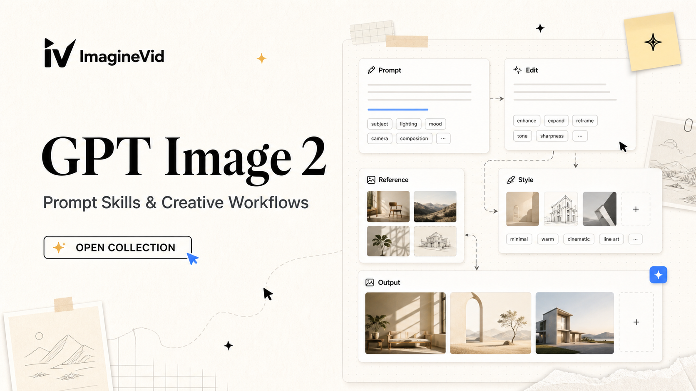

<a href="https://github.com/imaginevid-ai/Awesome-gpt-image-2-prompts-and-skills">
  
</a>

> prompt craft ను production-ready visuals గా మార్చే GPT Image 2 Library workflows ను చూడండి.
# Awesome GPT Image 2 Prompts మరియు Skills

[](https://github.com/sindresorhus/awesome)
[](https://github.com/imaginevid-ai/Awesome-gpt-image-2-prompts-and-skills)
[](https://creativecommons.org/licenses/by/4.0/)
[](https://github.com/imaginevid-ai/Awesome-gpt-image-2-prompts-and-skills/actions)
[](docs/CONTRIBUTING.md)

> GPT Image 2 Library ఎంపిక చేసిన GPT Image 2 prompts, తిరిగి ఉపయోగించగల prompt skills మరియు visual examples సంకలనం

> **కాపీరైట్ గమనిక**: prompts విద్యా మరియు సృజనాత్మక సూచన కోసం attribution తో సేకరించబడ్డాయి లేదా సమర్పించబడ్డాయి. ఏదైనా content తొలగించాలి అయితే issue తెరవండి.

---

[](README.md) [](README_zh.md) [](README_zh-TW.md) [](README_ja-JP.md) [](README_ko-KR.md) [](README_th-TH.md) [](README_vi-VN.md) [](README_hi-IN.md) [](README_es-ES.md) [-Click%20to%20View-lightgrey)](README_es-419.md)
[](README_de-DE.md) [](README_fr-FR.md) [](README_it-IT.md) [-Click%20to%20View-lightgrey)](README_pt-BR.md) [](README_pt-PT.md) [](README_tr-TR.md) [](README_ar-SA.md) [](README_bn-BD.md) [](README_ur-PK.md) [](README_id-ID.md)
[](README_ms-MY.md) [](README_ru-RU.md) [](README_nl-NL.md) [](README_pl-PL.md) [](README_sv-SE.md) [](README_da-DK.md) [](README_nb-NO.md) [](README_fi-FI.md) [](README_el-GR.md) [](README_cs-CZ.md)
[](README_hu-HU.md) [](README_ro-RO.md) [](README_uk-UA.md) [](README_he-IL.md) [](README_fa-IR.md) [](README_fil-PH.md) [](README_sw-KE.md) [](README_ta-IN.md) [](README_te-IN.md) [](README_mr-IN.md)
[](README_pa-IN.md) [](README_gu-IN.md) [](README_kn-IN.md) [](README_ml-IN.md) [](README_my-MM.md) [](README_jv-ID.md)

---

## ఎంపిక చేసిన సంకలనం చూడండి

**[GPT Image 2 prompt collection బ్రౌజ్ చేయండి](https://github.com/imaginevid-ai/Awesome-gpt-image-2-prompts-and-skills)**

ఈ collection ఎందుకు ఉపయోగించాలి?

Project links stay inside this repository; model capability sources point to official OpenAI documentation.

| ఫీచర్ | GitHub README | GPT Image 2 Library Collection |
|---------|--------------|---------------------|
| విజువల్ లేఅవుట్ | Linear list | Curated visual sections |
| శోధన | Ctrl+F only | Structured categories |
| Prompt workflow | - | Reusable prompt skills |
| మొబైల్ | Basic | Readable in every README locale |
| వర్గాలు | - | Category browsing |


### వర్గం వారీగా చూడండి

- [**Directed Editing & Input Control**](#workflow-directed-editing-input-control) - Prompts that modify an existing image or use regions, sketches, references, and positional instructions to control the result.
- [**Commercial Design, UI & Posters**](#workflow-commercial-design-ui-posters) - Production briefs for advertisements, product campaigns, interfaces, posters, typography, and other designed assets.
- [**Diagrams, Technical Art & Storyboards**](#workflow-diagrams-technical-storyboards) - Structured visuals where information order matters: diagrams, technical drawings, multi-panel sequences, and storyboards.
- [**Characters, Cinema & Visual Styles**](#workflow-characters-cinema-visual-styles) - Character, portrait, fashion, cinematic-frame, and style-exploration prompts centered on visual direction and image language.
- [**Environments, Architecture & Worldbuilding**](#workflow-environments-architecture-worldbuilding) - Environment, architecture, landscape, concept-art, and worldbuilding prompts where the place itself carries the idea.
- [**Benchmarks & Model Comparisons**](#workflow-benchmarks-model-comparisons) - Controlled tests and comparisons used to evaluate prompt following, editing behavior, consistency, typography, or visual quality.

---

## విషయ సూచిక

- [ఎంపిక చేసిన సంకలనం చూడండి](#)
- [GPT Image 2 అంటే ఏమిటి?](#gpt-image-2)
- [గణాంకాలు](#)
- [Community · ప్రత్యేక prompts](#community-featured-prompts)
- [Community · అన్ని prompts](#community-prompt-cases)
- [ఎలా తోడ్పడాలి](#)
- [లైసెన్స్](#)
- [కృతజ్ఞతలు](#)
- [Star చరిత్ర](#star)

---

## GPT Image 2 అంటే ఏమిటి?

**GPT Image 2** is an OpenAI GPT Image model documented for image generation and image edits. This repository is a source-backed collection template for prompts: accepted examples should keep original attribution, media evidence, and enough context to reproduce or adapt the workflow.

- **GPT Image Models** - OpenAI documents GPT Image models, including `gpt-image-2`, in its image generation guide
- **Image API** - Use generations for prompt-to-image requests and edits to modify existing images with a new prompt
- **Responses API** - Use image generation inside conversational or multi-step flows when the image should stay in context
- **Multi-Turn Editing** - Iterate across turns by refining prompts, applying new instructions, or editing an image already in the conversation
- **Output Controls** - Where supported, adjust size, quality, output format, and compression
- **Repository Scope** - This repo curates reusable prompts and public examples; it is not official OpenAI documentation or a model benchmark

**Project resources:** [OpenAI image generation guide](https://developers.openai.com/api/docs/guides/image-generation) · [OpenAI Image API reference](https://developers.openai.com/api/reference/resources/images) · [GPT Image 2 prompt collection](https://github.com/imaginevid-ai/Awesome-gpt-image-2-prompts-and-skills)

### Prompt Skill Arguments

Some prompts support dynamic placeholders using Raycast Snippets-style `{argument ...}` syntax. Look for the Raycast Friendly badge.

**Example:**
```
A cinematic poster for "{argument name="product" default="a glass AI camera"}" with {argument name="mood" default="midnight studio lighting"}
```

Replace the arguments to reuse the prompt as a compact creative skill.

---

## గణాంకాలు

<div align="center">

| మెట్రిక్ | సంఖ్య |
|--------|-------|
| మొత్తం prompts | **66** |
| ప్రత్యేకం | **12** |
| చివరి నవీకరణ | **13, జులై 2026, సోమవారం 2:28:07 AM UTCకి** |

</div>

---

<a id="community-featured-prompts"></a>

## Community · ప్రత్యేక prompts

> Hand-picked for reusable structure, visual clarity, and creative range

<a id="prompt-1"></a>

### No. 1: Identity-preserving reference edit


#### వివరణ

A source-backed GPT Image 2 editing prompt focused on preserving identity, pose, or composition while restyling the final image.

#### Prompt

```
Full-body cinematic studio portrait of an athletic man using the reference image standing with his back to the camera, looking over his shoulder with a sharp glance. He is holding a traditional Japanese katana sword resting downward near his side. He is wearing a dark olive green sleeveless tank top, ultra-baggy cream-colored streetwear trousers, and dark sunglasses. The setting is a dark, minimalist concrete studio floor filled with subtle atmospheric haze and smoke. Directly behind him is a massive, bright white square softbox light panel, creating a powerful backlit silhouette effect with intense rim lighting that highlights the muscular definition of his arms and back. Cinematic composition, raw photography style, high contrast, dramatic chiaroscuro mood, sharp details, 85mm lens, f/2.8. --ar 4:5
```

#### సృష్టించిన చిత్రాలు

<table>
<tr>
<td width="50%" valign="top" align="center"></td>
<td width="50%" valign="top" align="center"></td>
</tr>
</table>

#### వివరాలు

- **రచయిత:** [@Xaroon_x](https://x.com/Xaroon_x)
- **మూలం:** [మూలం](https://x.com/Xaroon_x/status/2075531198760210491)
- **ప్రచురితం:** 10 జులై, 2026
- **భాషలు:** en

**[ఈ prompt ఉపయోగించండి · GPT Image 2 Library](https://github.com/imaginevid-ai/Awesome-gpt-image-2-prompts-and-skills)**

---

<a id="prompt-2"></a>

### No. 2: Luxury studio fashion editorial


#### వివరణ

A reusable commercial prompt for polished product, food, or brand-ready campaign visuals with controlled lighting and layout.

#### Prompt

```
Transform my uploaded character reference into an ultra-realistic cinematic signature poster inspired by the uploaded master reference. Preserve my identity exactly—facial structure, skin texture, hairstyle, expression, proportions, age, and all recognizable features. Use the master reference only for the poster style, composition, lighting, framing, typography, color palette, and premium editorial look. Never copy the person from the reference.
Create a chest-up sports editorial portrait with a simple black textured athletic top or black crewneck (no logos). Use a high-contrast monochrome black-and-white treatment for the face, while the background features a bold solid accent color. The subject should face slightly away from the camera with the head tilted upward, looking off-frame with a calm, determined, heroic expression.
Place a clean rectangular color panel behind the subject inside a warm off-white textured paper border. Accent Color: <insert color>. Apply the same color consistently to the background panel, typography, signature, and number. If no color is specified, choose a premium tone such as deep emerald, royal blue, violet, burnt orange, mustard yellow, crimson, teal, or slate gray.
Use dramatic magazine-style studio lighting with a soft key light from the upper front-left, realistic skin texture, detailed hair, crisp catchlights, deep blacks, cinematic contrast, and premium editorial quality.
Name: <insert name>
Number: <insert jersey number>
If a full name is provided, place the first name in small uppercase above a large elegant handwritten surname. If only one name is given, use it as the signature. If no name or number is provided, omit them completely. Typography should be minimal, premium, and perfectly integrated into the design.
Keep the composition clean, centered, iconic, and expensive-looking. Avoid logos, brand names, sports club logos, messy typography, distorted anatomy, plastic skin, blurry details, duplicate faces, overexposure, or anything that looks artificial.
Final Output: 4:5 vertical, ultra-high-resolution, premium sports editorial poster, monochrome portrait, colored accent panel, off-white textured border, black clothing, cinematic lighting, subtle paper grain, razor-sharp details, polished social-media-ready finish.
```

#### సృష్టించిన చిత్రాలు

<table>
<tr>
<td width="25%" valign="top" align="center"></td>
<td width="25%" valign="top" align="center"></td>
<td width="25%" valign="top" align="center"></td>
<td width="25%" valign="top" align="center"></td>
</tr>
</table>

#### వివరాలు

- **రచయిత:** [@frametheory058](https://x.com/frametheory058)
- **మూలం:** [మూలం](https://x.com/frametheory058/status/2075418603650761001)
- **ప్రచురితం:** 10 జులై, 2026
- **భాషలు:** en

**[ఈ prompt ఉపయోగించండి · GPT Image 2 Library](https://github.com/imaginevid-ai/Awesome-gpt-image-2-prompts-and-skills)**

---

<a id="prompt-3"></a>

### No. 3: Low-key monochrome portrait edit


#### వివరణ

A source-backed GPT Image 2 editing prompt focused on preserving identity, pose, or composition while restyling the final image.

#### Prompt

```
Create a hyper-realistic black and white low-key fashion portrait based on the uploaded reference image. Keep the exact same composition, square framing, camera angle, subject placement, upper-body crop, head tilt, shoulder position, body angle, background, lighting direction, shadow placement, contrast, grain texture and overall dark editorial mood.
Replace only the original person with the character from the newly uploaded target reference image.
```

#### సృష్టించిన చిత్రాలు

<table>
<tr>
<td width="50%" valign="top" align="center"></td>
<td width="50%" valign="top" align="center"></td>
</tr>
</table>

#### వివరాలు

- **రచయిత:** [@Sairah_0](https://x.com/Sairah_0)
- **మూలం:** [మూలం](https://x.com/Sairah_0/status/2074340907063882082)
- **ప్రచురితం:** 7 జులై, 2026
- **భాషలు:** en

**[ఈ prompt ఉపయోగించండి · GPT Image 2 Library](https://github.com/imaginevid-ai/Awesome-gpt-image-2-prompts-and-skills)**

---

<a id="prompt-4"></a>

### No. 4: Flat-vector doodle character poster


#### వివరణ

A character, portrait, or stylized illustration prompt with clear art direction and reusable visual constraints.

#### Prompt

```
Reconstruct this image as a single flat illustration infused with playful, childlike doodle elements. Use a bold, vibrant, and whimsical color palette, simplifying every detail into clean, flat shapes. Incorporate a handcrafted feel with slightly imperfect, hand-drawn outlines to create a charming, imaginative aesthetic, as if it were illustrated on a sheet of white paper. The overall style should be cute, expressive, and delightfully whimsical.
```

#### సృష్టించిన చిత్రాలు

<table>
<tr>
<td width="50%" valign="top" align="center"></td>
<td width="50%" valign="top" align="center"></td>
</tr>
</table>

#### వివరాలు

- **రచయిత:** [@Ciri_ai](https://x.com/Ciri_ai)
- **మూలం:** [మూలం](https://x.com/Ciri_ai/status/2071082104817885419)
- **ప్రచురితం:** 28 జూన్, 2026
- **భాషలు:** en

**[ఈ prompt ఉపయోగించండి · GPT Image 2 Library](https://github.com/imaginevid-ai/Awesome-gpt-image-2-prompts-and-skills)**

---

<a id="prompt-5"></a>

### No. 5: Luxury studio fashion editorial 2


#### వివరణ

A reusable commercial prompt for polished product, food, or brand-ready campaign visuals with controlled lighting and layout.

#### Prompt

```
A handsome young European man in a high-end fashion studio photoshoot, standing confidently against a seamless dark charcoal backdrop. He wears a perfectly tailored luxury designer suit in deep black, paired with a crisp white shirt and refined accessories, showcasing timeless elegance and modern sophistication. Minimalist studio environment with no distracting props, all attention directed toward his presence, expression, and confident posture.
Cinematic low-key lighting setup with a single large softbox creating soft highlights across his face and outfit, subtle rim light separating him from the background, deep shadows, dramatic contrast, and a moody editorial atmosphere. Natural skin texture, well-groomed hairstyle, sharp facial features, confident gaze, powerful stance, luxury fashion campaign aesthetic.
Ultra-realistic DSLR photography, premium men's fashion editorial, shallow depth of field, 85mm lens, f/1.8, tack-sharp focus on the model, background fading into darkness, exceptional tailoring detail, realistic lighting falloff, rich tonal depth, cinematic color grading, luxury magazine cover quality, masterpiece composition, photorealistic, RAW photo quality, 8K resolution, highly detailed, professional studio fashion campaign, focused entirely on the model.
```

#### సృష్టించిన చిత్రాలు

<table>
<tr>
<td width="25%" valign="top" align="center"></td>
<td width="25%" valign="top" align="center"></td>
<td width="25%" valign="top" align="center"></td>
<td width="25%" valign="top" align="center"></td>
</tr>
</table>

#### వివరాలు

- **రచయిత:** [@john_my07](https://x.com/john_my07)
- **మూలం:** [మూలం](https://x.com/john_my07/status/2075071069073862733)
- **ప్రచురితం:** 9 జులై, 2026
- **భాషలు:** en

**[ఈ prompt ఉపయోగించండి · GPT Image 2 Library](https://github.com/imaginevid-ai/Awesome-gpt-image-2-prompts-and-skills)**

---

<a id="prompt-6"></a>

### No. 6: Modular editorial collage poster


#### వివరణ

A structured design prompt for editorial posters, typography systems, collage layouts, or modular visual pages.

#### Prompt

```
Ultra-realistic 6-photo collage (3×2 grid) of the same person using client photo for identity only (exact face, facial features, eye color, natural hair color/length/volume/texture). Plain light grey-blue wall background, black thin-strap camisole, minimal jewelry, Canon PowerShot G7X Mark III strong direct flash, hard shadows, sharp focus, natural skin texture, slight film grain.

Instagram photo dump aesthetic. Six unique expressions/poses:
(1) soft smile, hands on cheeks,
(2) wink, big smile, hand in hair,
(3) eyes closed, tongue slightly out, both hands lifting hair,
(4) confident side glance, hand under chin, (5) laughing, looking away, hair flipped, (6) dreamy look, hand touching hair. Different hair positions in every frame. No AI look, no distorted hands, no extra fingers. --ar 3:4
```

#### సృష్టించిన చిత్రాలు

<table>
<tr>
<td width="100%" valign="top" align="center"></td>
</tr>
</table>

#### వివరాలు

- **రచయిత:** [@MissDelulu9](https://x.com/MissDelulu9)
- **మూలం:** [మూలం](https://x.com/MissDelulu9/status/2075098749777674475)
- **ప్రచురితం:** 9 జులై, 2026
- **భాషలు:** en

**[ఈ prompt ఉపయోగించండి · GPT Image 2 Library](https://github.com/imaginevid-ai/Awesome-gpt-image-2-prompts-and-skills)**

---

<a id="prompt-7"></a>

### No. 7: Identity-preserving reference edit 2


#### వివరణ

A precise GPT Image 2 prompt for blueprint-style diagrams, specification sheets, and readable technical visual systems.

#### Prompt

```
Conceptual futuristic editorial poster design featuring [HUMAN] in a large side-profile portrait, wearing [CLOTHING], sleek contemporary fashion styling, clean studio lighting, white background with bold [COLOR1] graphic shapes, fine [COLOR2] circuit-like line diagrams, and subtle [COLOR3] interface accents. Large uppercase title "[TITLE]" placed prominently at the top, a short block of small editorial text reading "[TEXT]", modern experimental typography, asymmetrical magazine layout, sharp high-contrast composition, premium graphic design aesthetic, 4:5 aspect ratio.
```

#### సృష్టించిన చిత్రాలు

<table>
<tr>
<td width="25%" valign="top" align="center"></td>
<td width="25%" valign="top" align="center"></td>
<td width="25%" valign="top" align="center"></td>
<td width="25%" valign="top" align="center"></td>
</tr>
</table>

#### వివరాలు

- **రచయిత:** [@Kashberg_0](https://x.com/Kashberg_0)
- **మూలం:** [మూలం](https://x.com/Kashberg_0/status/2075055474861555843)
- **ప్రచురితం:** 9 జులై, 2026
- **భాషలు:** en

**[ఈ prompt ఉపయోగించండి · GPT Image 2 Library](https://github.com/imaginevid-ai/Awesome-gpt-image-2-prompts-and-skills)**

---

<a id="prompt-8"></a>

### No. 8: Identity-preserving reference edit 3


#### వివరణ

A source-backed GPT Image 2 editing prompt focused on preserving identity, pose, or composition while restyling the final image.

#### Prompt

```
A cinematic close-up portrait of a young East Asian woman with long slightly messy black hair falling across her face, porcelain skin, soft pink lips, and deep expressive eyes. She gazes directly into the camera with a calm, melancholic expression. Dramatic low-key lighting illuminates only parts of her face, creating strong contrast against a dark shadowy background. Subtle strands of hair move gently as if touched by a breeze, adding a natural and emotional feel. Moody atmosphere, minimalist composition, soft skin texture, delicate facial details, editorial beauty photography, subtle grain, muted colors, intimate and mysterious mood, ultra-realistic, high detail, captured like an artistic film still.
```

#### సృష్టించిన చిత్రాలు

<table>
<tr>
<td width="50%" valign="top" align="center"></td>
<td width="50%" valign="top" align="center"></td>
</tr>
</table>

#### వివరాలు

- **రచయిత:** [@saniaspeaks_](https://x.com/saniaspeaks_)
- **మూలం:** [మూలం](https://x.com/saniaspeaks_/status/2073252816152650224)
- **ప్రచురితం:** 4 జులై, 2026
- **భాషలు:** en

**[ఈ prompt ఉపయోగించండి · GPT Image 2 Library](https://github.com/imaginevid-ai/Awesome-gpt-image-2-prompts-and-skills)**

---

<a id="prompt-9"></a>

### No. 9: Rainy mountain lifestyle portrait


#### వివరణ

A visual prompt for modern interiors, spatial atmosphere, architecture, or lifestyle scenes with realistic material detail.

#### Prompt

```
A mountain lifestyle portrait captured after the rain, evoking the atmosphere of a cool evening; a candid shot using flash.

Create an image without altering facial features. Strictly maintain 100% likeness to the reference. Preserve the shape of the face, eyes, eyebrows, nose, lips, proportions, hair color, and all unique characteristics exactly as they appear in the reference image. No smoothing, no retouching, and no changes to facial geometry. Natural skin texture with visible pores.

Vertical 4:5 format. Shot on a Canon G7X Mark III with flash. Camera at chest level; a hip-up shot. Slight digital grain, subdued exposure, no filters, no text or watermarks. Do not blur the background.

A young woman stands in a green mountain meadow. Her body is turned slightly to the left, while her head is turned to the right. She is smiling softly, gazing into the distance rather than at the camera. Both hands are relaxed in front of her; she holds a pair of narrow, dark brown sunglasses in one hand. Short, square-shaped nails with a French manicure.

Hair color and length must strictly match the reference. Very long hair (reaching the waist), styled with a round brush (brush not visible in the frame); a layered, cascading cut with ends neatly curled inward—no waves. Hair is worn loose and slightly tousled by the wind, with a few strands resting softly against her face.

She is wearing a form-fitting, chocolate-brown outfit consisting of a short-sleeved T-shirt and wide-leg, low-rise trousers; the soft fabric accentuates her silhouette. She wears a small Van Cleef & Arpels Alhambra pendant and a Cartier Love bracelet. In the background, there is a spacious green field, a wooden fence, and a grazing horse. Thick fog hangs in the air, and the towering mountains are completely shrouded in heavy, dark-gray rain clouds. It is a cool mountain evening, with the atmosphere of the air just after the rain.

A harsh Canon flash brightly illuminates the young woman; her skin is slightly overexposed, creating distinctive highlights on her face and clothing. The background remains naturally dark and atmospheric, yet the details of the field, fence, horse, and mountains are clearly visible. A lively, spontaneous lifestyle shot with maximum photorealism.
```

#### సృష్టించిన చిత్రాలు

<table>
<tr>
<td width="33%" valign="top" align="center"></td>
<td width="33%" valign="top" align="center"></td>
<td width="33%" valign="top" align="center"></td>
</tr>
</table>

#### వివరాలు

- **రచయిత:** [@Sairah_0](https://x.com/Sairah_0)
- **మూలం:** [మూలం](https://x.com/Sairah_0/status/2072893533846147296)
- **ప్రచురితం:** 3 జులై, 2026
- **భాషలు:** en

**[ఈ prompt ఉపయోగించండి · GPT Image 2 Library](https://github.com/imaginevid-ai/Awesome-gpt-image-2-prompts-and-skills)**

---

<a id="prompt-10"></a>

### No. 10: Luxury studio fashion editorial 3


#### వివరణ

A structured design prompt for editorial posters, typography systems, collage layouts, or modular visual pages.

#### Prompt

```
Avant-garde graphic design poster page, elegant editorial layout, off-white background, 4:5 aspect ratio. Build a clean asymmetrical modular grid with four distinct image blocks: one high-contrast close portrait of [HUMAN], one cinematic photograph of [CAR], one striking image of [ANIMAL], and one atmospheric photograph of [PLACE], each contained in its own rectangular block. Use black as the dominant color with subtle accents of [ACCENT1] and [ACCENT2], minimal but refined. Add one abstract distortion or texture panel to reinforce the experimental design language. Include a bold title reading “[TITLE]”, a small minimalist logo reading “[LOGO]”, microtypography, short editorial text columns, tiny serial numbers, thin dividers, small captions, and elegant negative space. High-fashion graphic design aesthetic, niche magazine page, refined Swiss-meets-avant-garde composition, crisp typography, monochrome photography, subtle blur and texture variation, sophisticated art-direction.
```

#### సృష్టించిన చిత్రాలు

<table>
<tr>
<td width="25%" valign="top" align="center"></td>
<td width="25%" valign="top" align="center"></td>
<td width="25%" valign="top" align="center"></td>
<td width="25%" valign="top" align="center"></td>
</tr>
</table>

#### వివరాలు

- **రచయిత:** [@SimplyAnnisa](https://x.com/SimplyAnnisa)
- **మూలం:** [మూలం](https://x.com/SimplyAnnisa/status/2073433391530455535)
- **ప్రచురితం:** 4 జులై, 2026
- **భాషలు:** en

**[ఈ prompt ఉపయోగించండి · GPT Image 2 Library](https://github.com/imaginevid-ai/Awesome-gpt-image-2-prompts-and-skills)**

---

<a id="prompt-11"></a>

### No. 11: Premium food and beverage campaign


#### వివరణ

A reusable commercial prompt for polished product, food, or brand-ready campaign visuals with controlled lighting and layout.

#### Prompt

```
A candid phone snapshot of a pretty young East Asian woman in her early 20s sitting on a subway train, absorbed in her phone. She has shoulder-length dark chestnut hair with warm caramel-brown highlights, slightly wavy and loose, a few strands falling across her cheek. White wired earbuds in her ears, the cable running down to the phone in her hands. She looks down at the screen with a calm, absorbed expression, lips softly closed, natural skin with minimal makeup. She has an attractive figure — she wears a fitted white short-sleeve t-shirt with a scoop neckline that hugs her upper body, a thin gold chain necklace at her collarbone, and a grey knit mini skirt, her bare legs crossed as she sits. A tan brown leather handbag rests on her lap, the strap draped over her knee. The subway car around her is bright and utilitarian — a stainless steel pole in the foreground on the left, partially blocking the frame and slightly out of focus; a red vertical grab pole on the right; sliding doors with windows; overhead advertisement panels; small red no-smoking warning stickers on the door glass. Bright fluorescent train lighting, slightly cool and even, with mild motion blur at the frame edges from the moving train. Shot from across the aisle on a phone, slightly candid off-center framing, natural image noise, soft focus — the authentic look of a quick unposed photo taken on public transit.16:9

第二步：使用 kling 生成影片 🎬

prompt 👇

风格：真实地铁车厢偷拍感，轻微手持晃动，车厢自然冷白灯，轻微压缩画质，微弱运动模糊。

0-3 秒

女生坐在金属座椅上，身体靠着车厢墙，低头看手机。她一只手拿手机，另一只手自然搭在棕色小包附近，白色耳机线垂在胸前和大腿上。表情放松、没有防备。镜头从斜前方拍摄，左侧有模糊立柱遮挡，地铁轻微晃动。

3-5 秒

她像是察觉有人在拍，手指停顿一下，眼神先从手机屏幕上移到镜头方向。不要突然抬头，要慢慢抬眼：先眼睛动，再微微抬下巴。表情从放松变成冷静审视，带一点“你在拍我？”的疑惑和压迫感。

5-7 秒

她保持看镜头，嘴唇轻轻抿住，眉眼微微收紧，不笑，不说话。手机还握在手里，身体基本不动，只是肩膀和呼吸有细微起伏。这个阶段重点是眼神：平静、淡定、带一点挑衅和不躲闪。

7-10 秒

她视线仍然锁住镜头，另一只手缓慢移到大腿处，从灰色短裙/裤脚边缘轻轻往上拉一下，短暂露出一点黑色蕾丝边。动作幅度很小、真实、自然，不夸张，不大幅裸露。拉完后手停在大腿旁边，她仍然看着镜头，表情很淡，像是在无声回应拍摄者。

声音

无对白。只有地铁行驶低频声、车厢轻微震动、远处模糊乘客声。

负面提示词

不要字幕，不要水印，不要换场景，不要站起来，不要大幅动作，不要夸张微笑，不要说话口型，不要色情化，不要过度裸露。必须是从大腿裤脚/裙摆边缘轻轻拉起，露出一点黑色蕾丝边；不要拉腰部。保持首帧人物、衣服、包、手机、耳机线和地铁结构完全一致。
```

#### సృష్టించిన చిత్రాలు

<table>
<tr>
<td width="50%" valign="top" align="center"></td>
<td width="50%" valign="top" align="center"></td>
</tr>
</table>

#### వివరాలు

- **రచయిత:** [@johnAGI168](https://x.com/johnAGI168)
- **మూలం:** [మూలం](https://x.com/johnAGI168/status/2074860620424401376)
- **ప్రచురితం:** 8 జులై, 2026
- **భాషలు:** zh

**[ఈ prompt ఉపయోగించండి · GPT Image 2 Library](https://github.com/imaginevid-ai/Awesome-gpt-image-2-prompts-and-skills)**

---

<a id="prompt-12"></a>

### No. 12: Panelled cinematic storyboard board


#### వివరణ

A production-oriented prompt that turns a concept into a panelled storyboard or first-frame asset for downstream video work.

#### Prompt

```
TITLE
The Piece of Bread
REFERENCE
Use the provided combined character sheet and storyboard board as the main visual reference. Follow the same woman design, stray cat design, bread, sidewalk, low wall, cloth shoulder bag, water bottle, warm sunset lighting, and emotional story beats. Keep the woman and cat visually consistent in every shot. Do not add extra characters. Do not change the core story.

SUBJECTS

Woman: A young woman in her early 20s with shoulder-length slightly messy dark brown hair loosely tied back, a soft oval face, gentle expressive anime eyes, and a tired but kind expression. She wears a faded oversized hoodie, loose trousers, worn sneakers, and carries a simple cloth shoulder bag. She appears hungry, humble, compassionate, and resilient. Her acting should remain subtle, natural, and emotional.

Cat: A small original stray cat with short charcoal-gray fur, a cream-colored chest and paws, one ear with a tiny notch, a long curved tail, and expressive anime-style eyes. The cat feels timid, hungry, hopeful, innocent, and lovable. It begins cautious and hungry, then gradually becomes trusting and comforted.

Bread: One small round bread bun. This is the central story object. The woman breaks it into two pieces and shares one half with the cat.

ENVIRONMENT

Quiet city sidewalk at sunset. Low concrete wall behind them. Soft blurred road and distant buildings in the background. A simple cloth shoulder bag and a small water bottle placed beside the woman. Warm golden-hour light with long shadows. Peaceful, lonely, emotional atmosphere.

STYLE

2D Japanese anime short film with a hand-drawn aesthetic. Clean inked outlines, flat-to-soft cel shading, simplified shadow blocks, no CG or 3D rendering. Soft emotional storytelling. Warm golden-hour lighting with painterly anime backgrounds. Expressive anime eyes with subtle, believable facial acting. Gentle cinematic movement with a traditional anime animation feel. No 3D render. No CGI. No Pixar-style shading. No photorealism. No comedy. No chaos. No copyrighted characters. No text. No subtitles. No logos. No social media UI. No background music—only natural ambient sound effects.

CAMERA

16:9 cinematic framing. Use close-ups and medium shots to emphasize emotion. End with one wide cinematic shot. Slow push-ins and gentle cuts. Shallow depth of field. Keep both characters clear and expressive. Avoid fast movement or exaggerated actions.

TIMELINE

0:00–0:02

Extreme close-up.

The woman slowly lifts a small bread bun toward her mouth. She is about to take a bite. Warm sunset light softly illuminates her face and hands. Her expression shows hunger, exhaustion, and quiet resilience. She pauses just before eating.

SFX: quiet street ambience, soft breathing, gentle hand movement.

---

0:02–0:04

Medium shot from the woman's side.

A small stray cat sits a few feet away on the sidewalk. The cat gazes at the bread with sad, hopeful eyes. It remains still, timid, and cautious. The woman notices the cat and slowly lowers the bread.

SFX: soft cat meow, light breeze, distant city ambience.

---

0:04–0:06

Close-up of the woman's hands.

She slowly breaks the bread into two pieces. Tiny crumbs fall gently. The moment feels like an important emotional decision. Her hands pause briefly after splitting the bread.

SFX: soft bread tearing, tiny crumbs falling.

---

0:06–0:08

Medium side shot.

The woman gently extends one half of the bread toward the cat. The cat looks at the bread, then into the woman's eyes. It is nervous but curious. The woman gives a soft, reassuring smile and keeps her hand perfectly still.

SFX: gentle hand movement, cat sniffing, quiet breeze.

---

0:08–0:10

Low close shot near the cat.

The cat slowly steps forward. It carefully takes the bread from the woman's hand. The woman remains calm and gentle. The cat begins eating, and its expression gradually softens into trust.

SFX: tiny paw steps, soft bite, gentle chewing.

---

0:10–0:12

Medium shot.

The woman sits comfortably on the sidewalk. The cat comes closer and sits beside her. She gently strokes the cat's head. The cat leans into her hand and relaxes. The moment feels warm, peaceful, and safe.

SFX: soft fur brushing, content cat purring, distant street ambience.

---

0:12–0:14

Close emotional shot.

The cat rests its head on the woman's lap. She looks down with a warm, slightly bittersweet smile. She still holds her own half of the bread in her other hand. Both appear comforted, no longer feeling completely alone.

SFX: quiet breathing, soft breeze, distant city sounds.

---

0:14–0:15

Wide sunset shot from behind.

The woman and the cat sit side by side facing the glowing sunset. Their long shadows stretch across the sidewalk. The cloth shoulder bag and water bottle rest nearby. The final frame feels peaceful, hopeful, and heartwarming.

SFX: soft wind, distant street ambience, gentle satisfied cat purr.

Storyboard Prompt:

Create a single horizontal animation pre-production board for an original emotional 2D anime-style short film titled "The Piece of Bread." The output must be one image only and combine:

1. a character design sheet

2. a hand-drawn storyboard page.

IMPORTANT
Do not make the woman or cat resemble any reference screenshots or existing characters. Keep the same emotional story concept, but create completely original character designs, unique silhouettes, and distinct facial features. No copyrighted characters or close resemblance to any existing animated films or anime.

STYLE

Professional anime production board. Hand-drawn storyboard style with loose pencil sketch lines, light gray shading, red panel borders, blue motion arrows, and short handwritten production notes. Rendered with anime-inspired linework featuring clean inked outlines, expressive eyes, and simplified shading blocks. It should look like a real animation studio planning sheet, not a polished final illustration.

LAYOUT

Clean horizontal 16:9 board divided into two sections.

SECTION A: CHARACTER SHEET

Show both characters consistently.

Woman

A young woman in her early 20s with shoulder-length slightly messy dark brown hair tied loosely at the back, a soft oval face, gentle expressive anime eyes, and a tired but kind expression. She wears a faded oversized hoodie, loose trousers, worn sneakers, and carries a simple cloth shoulder bag. She should appear humble, exhausted, compassionate, and resilient.

Show:

front view

side view

3/4 view

expressions: hungry, thoughtful, soft smile, emotional

pose holding a small bread bun

pose offering bread

Cat

A small original stray cat with short charcoal-gray fur, a cream-colored chest and paws, slightly oversized anime-style eyes, one ear with a tiny notch, and a long curved tail. The cat should feel timid, hungry, hopeful, innocent, and lovable.

Show:

front view

side view

3/4 view

expressions: sad, shy, hopeful, happy, trusting

sitting pose

taking bread pose

cuddling beside the woman

Include tiny handwritten notes and a few small color swatches.

SECTION B: STORYBOARD

Create 8 cinematic storyboard panels arranged neatly in a grid. Keep character designs consistent throughout. Each panel should include simple handwritten shot notes and blue arrows indicating motion.

STORY BEATS

1. Close-up of the woman about to take a bite from a small bread bun during sunset.

2. Medium shot of the hungry stray cat sitting nearby, staring at the bread with sad, hopeful eyes.

3. Close-up of the woman breaking the bread into two pieces as crumbs fall.

4. Medium shot of the woman offering one piece to the cat.

5. Close shot of the cat cautiously stepping forward and taking the bread.

6. Medium shot of the cat sitting beside the woman while she gently pets it.

7. Emotional close-up of the cat resting its head on the woman's lap.

8. Wide sunset shot from behind, showing the woman and cat sitting together with a cloth bag and water bottle beside them.

ENVIRONMENT

Quiet city sidewalk beside a low wall, soft urban background, cloth shoulder bag, small water bottle, warm golden sunset lighting, peaceful atmosphere, and an emotional mood.

FINAL GOAL

Create a dense, clean, production-ready anime pre-production board combining a character design sheet and storyboard in a single 16:9 horizontal image, conveying a heartfelt story of compassion and kindness through completely original character designs.
```

#### సృష్టించిన చిత్రాలు

<table>
<tr>
<td width="100%" valign="top" align="center"></td>
</tr>
</table>

#### వివరాలు

- **రచయిత:** [@ZaraIrahh](https://x.com/ZaraIrahh)
- **మూలం:** [మూలం](https://x.com/ZaraIrahh/status/2074714913441009667)
- **ప్రచురితం:** 8 జులై, 2026
- **భాషలు:** en

**[ఈ prompt ఉపయోగించండి · GPT Image 2 Library](https://github.com/imaginevid-ai/Awesome-gpt-image-2-prompts-and-skills)**

---

<a id="community-prompt-cases"></a>

## Community · అన్ని prompts

> Twitter/X-sourced community prompt cases, sorted by publish date and curation order.

<a id="workflow-directed-editing-input-control"></a>

### Directed Editing & Input Control (9)

Prompts that modify an existing image or use regions, sketches, references, and positional instructions to control the result.

**Community · ప్రత్యేక prompts**

- [Identity-preserving reference edit](#prompt-1)
- [Low-key monochrome portrait edit](#prompt-3)
- [Identity-preserving reference edit 3](#prompt-8)

<a id="prompt-27"></a>

#### No. 1: Luxury studio fashion editorial 6


##### వివరణ

A source-backed GPT Image 2 editing prompt focused on preserving identity, pose, or composition while restyling the final image.

##### Prompt

```
Photorealistic, hyperrealistic black-and-white men’s fashion editorial portrait using the uploaded dramatic B&W side portrait as the exact, non-negotiable reference for: vertical framing, medium close-up crop (upper torso to slightly above hair),three-quarter side profile facing frame-right, camera height slightly below/level with face, head inclination downward toward the raised hand, hand-to-face gesture, wristwatch placement in the lower-left central area, torso direction, shoulder placement, negative space, dark studio background, lens perspective, depth of field, grain, contrast curve, shadow density, highlight intensity, and cinematic mood.

Replace ONLY the original subject with the person from the uploaded target character reference image, preserving the target’s identity with maximum facial/anatomical accuracy (head shape, facial proportions, hairstyle/hairline/texture, brows, eyes, nose profile, lips, cheekbones, jaw/chin, ears, skin tone, facial hair if present, neck/shoulders, hand proportions, natural build). Do not merge identities.

Maintain serious, introspective expression: eyes down, subtle brow contraction, neutral lips.

Dark long-sleeved knitwear with visible woven texture and minimal silhouette. Understated elegant analog wristwatch, round face, dark/neutral strap.

Low-key studio lighting: hard-to-medium key from high frame-left, angled downward, sculpted highlights and deep shadows, minimal fill. 85–105mm lens, f/2.8–f/4, compressed perspective, shallow DOF, sharp focus on illuminated eye area, nose bridge, hand, watch; rear shoulder/background softly blurred.

Preserve dominant black tonal mass on frame-right and softer mid-gray illumination on frame-left. 8K resolution, ultra high definition, highly detailed, sharp focus, professional photography, masterful composition, matte monochrome finish, fine analog grain; no text, logos, extra jewelry, background objects, direct eye contact, smile, pose changes, brightened shadows, overexposure, artificial sharpening.
```

##### సృష్టించిన చిత్రాలు

<table>
<tr>
<td width="50%" valign="top" align="center"></td>
<td width="50%" valign="top" align="center"></td>
</tr>
</table>

##### వివరాలు

- **రచయిత:** [@kingofdairyque](https://x.com/kingofdairyque)
- **మూలం:** [మూలం](https://x.com/kingofdairyque/status/2075226498416431473)
- **ప్రచురితం:** 9 జులై, 2026
- **భాషలు:** en

**[ఈ prompt ఉపయోగించండి · GPT Image 2 Library](https://github.com/imaginevid-ai/Awesome-gpt-image-2-prompts-and-skills)**

---

<a id="prompt-42"></a>

#### No. 2: Identity-preserving reference edit 6


##### వివరణ

A source-backed GPT Image 2 editing prompt focused on preserving identity, pose, or composition while restyling the final image.

##### Prompt

```
Photorealistic, cinematic action sequence. A young woman with short light-blue hair wearing a school uniform and a full-body harness prepares for a bungee jump on a high steel bridge. Crew members in dark uniforms check her gear. She dives forward. The camera tracks her top-down descent toward the deep blue ocean. As she nears the surface, a colossal, terrifying prehistoric sea monster breaches with jaws wide open to swallow her. At the last second, the bungee cord yanks her safely upward into a seated position. The monster crashes back into the sea, creating a massive, chaotic splash with realistic water dynamics. 8k, hyper-realistic, dramatic lighting, high-end Hollywood VFX.
​Prompt Breakdown
​Characters & Wardrobe: "young woman with short light-blue hair wearing a school uniform... Crew members in dark uniforms" establishes the distinct subjects.
​Setting & Environment: "bungee jump on a high steel bridge... deep blue ocean" creates the vertical scale and atmospheric location.
​Core Action & Camera: "dives forward... top-down descent... sea monster breaches with jaws wide open... bungee cord yanks her safely upward" dictates the narrative flow, camera angle, and the exact timing of the tension.
​VFX & Physics: "massive, chaotic splash with realistic water dynamics" ensures the interaction between the creature and the ocean looks authentic and powerful.
​Style Modifiers: "Photorealistic, cinematic action sequence... 8k, hyper-realistic, high-end Hollywood VFX" forces a live-action blockbuster aesthetic rather than an animated one.
```

##### సృష్టించిన చిత్రాలు

<table>
<tr>
<td width="100%" valign="top" align="center"></td>
</tr>
</table>

##### వివరాలు

- **రచయిత:** [@ChillaiKalan__](https://x.com/ChillaiKalan__)
- **మూలం:** [మూలం](https://x.com/ChillaiKalan__/status/2073325858908172426)
- **ప్రచురితం:** 4 జులై, 2026
- **భాషలు:** en

**[ఈ prompt ఉపయోగించండి · GPT Image 2 Library](https://github.com/imaginevid-ai/Awesome-gpt-image-2-prompts-and-skills)**

---

<a id="prompt-44"></a>

#### No. 3: Low-key monochrome portrait edit 3


##### వివరణ

A source-backed GPT Image 2 editing prompt focused on preserving identity, pose, or composition while restyling the final image.

##### Prompt

```
Use my face with same hairstyle to generate the image with this prompt
​“A stark, high-contrast, black-and-white (monochromatic) side-profile portrait of a person (gender-neutral, perhaps male or ambiguous) emerging from absolute darkness. The figure is almost entirely a silhouette, defined solely by a very intense, narrow rim light (edge lighting) that traces the outline of their head, back, and arm. They are wearing a dark, form-fitting turtleneck or sweater, which completely
disappears into the pure black background, emphasizing the glowing contour. The person is looking slightly upwards and to the side, conveying contemplation or a sense of aspiration.”
​ Details to Enhance Realism & Mood
​Subject: Gender-neutral or male figure, short hair, clean profile. The face is mostly in shadow, but the sharp line of light defines the jawline and brow.
​Lighting: Single, very hard, concentrated light source positioned
irectly behind and slightly to the side of the subject, creating a bright, glowing halo effect
```

##### సృష్టించిన చిత్రాలు

<table>
<tr>
<td width="100%" valign="top" align="center"></td>
</tr>
</table>

##### వివరాలు

- **రచయిత:** [@Naiknelofar788](https://x.com/Naiknelofar788)
- **మూలం:** [మూలం](https://x.com/Naiknelofar788/status/2073795757937996061)
- **ప్రచురితం:** 5 జులై, 2026
- **భాషలు:** en

**[ఈ prompt ఉపయోగించండి · GPT Image 2 Library](https://github.com/imaginevid-ai/Awesome-gpt-image-2-prompts-and-skills)**

---

<a id="prompt-59"></a>

#### No. 4: Monochrome football watch editorial


##### వివరణ

A new GPT Image 2 identity-preserving sports portrait prompt built around studio lighting, a national jersey, and restrained watch-campaign styling.

##### Prompt

```
Create an ultra-realistic black-and-white editorial portrait of the uploaded person. Preserve the exact face, hairstyle, facial proportions, skin tone, expression, and identity with 100% consistency. The subject wears a premium national football jersey with minimal branding, posed in a thoughtful, contemplative stance with one hand resting against the chin and the wrist slightly raised to showcase a minimalist luxury black leather watch with a clean analog dial. Eyes looking downward, calm and focused expression. Shot in a professional photography studio against a seamless charcoal-gray background. Dramatic Rembrandt lighting with soft directional light from camera left, deep cinematic shadows, high contrast, subtle rim light defining the jawline and shoulders, beautiful skin texture, razor-sharp focus. Fashion editorial aesthetic, luxury sports campaign, monochrome fine-art photography, medium close-up portrait, 85mm lens, f/1.8, shallow depth of field, natural film grain, HDR, ultra-detailed, photorealistic, premium watch advertisement quality, Vogue x GQ x Nike campaign style, 8K resolution. Negative prompt: cartoon, painting, CGI, low quality, blurry, oversaturated, extra fingers, deformed hands, duplicate limbs, distorted face, watermark, text, logo, frame, noise.
```

##### సృష్టించిన చిత్రాలు

<table>
<tr>
<td width="25%" valign="top" align="center"></td>
<td width="25%" valign="top" align="center"></td>
<td width="25%" valign="top" align="center"></td>
<td width="25%" valign="top" align="center"></td>
</tr>
</table>

##### వివరాలు

- **రచయిత:** [@Taaruk_](https://x.com/Taaruk_)
- **మూలం:** [మూలం](https://x.com/Taaruk_/status/2075786938326639006)
- **ప్రచురితం:** 11 జులై, 2026
- **భాషలు:** en

**[ఈ prompt ఉపయోగించండి · GPT Image 2 Library](https://github.com/imaginevid-ai/Awesome-gpt-image-2-prompts-and-skills)**

---

<a id="prompt-61"></a>

#### No. 5: Red marker illustration-over-photo edit


##### వివరణ

A newly published GPT Image 2 reference edit that keeps the subject photorealistic while redrawing the environment as loose monochrome marker art.

##### Prompt

```
Transform the original mirror selfie into a minimalist illustration-over-photo artwork. Keep the person completely photorealistic while replacing the surrounding environment with bold hand-drawn red marker line art. Outline the ornate vintage mirror frame, hallway, elevator, plants, tray, bottle, wicker basket, and foreground objects using loose sketchy red ink lines on a clean white background. Preserve the original pose, outfit (black baseball cap, beige overshirt, white T-shirt), facial expression, lighting, and composition. Create a high-contrast mixed-media effect where only the subject remains realistic and everything else appears as an expressive monochrome red line drawing. Modern editorial aesthetic, clean negative space, minimalist, artistic, high detail. Negative prompt: full illustration, anime, cartoon character, low quality, blurry, distorted face, extra limbs, duplicated objects, colored background, watercolor, heavy shading, text, logo, watermark, messy lines, oversaturated colors.
```

##### సృష్టించిన చిత్రాలు

<table>
<tr>
<td width="50%" valign="top" align="center"></td>
<td width="50%" valign="top" align="center"></td>
</tr>
</table>

##### వివరాలు

- **రచయిత:** [@Kashberg_0](https://x.com/Kashberg_0)
- **మూలం:** [మూలం](https://x.com/Kashberg_0/status/2075791794688675870)
- **ప్రచురితం:** 11 జులై, 2026
- **భాషలు:** en

**[ఈ prompt ఉపయోగించండి · GPT Image 2 Library](https://github.com/imaginevid-ai/Awesome-gpt-image-2-prompts-and-skills)**

---

<a id="prompt-64"></a>

#### No. 6: Beauty-retouch before-and-after split screen


##### వివరణ

A new GPT Image 2 enhancement-comparison prompt focused on legible before-and-after framing and close-up skin-detail restoration.

##### Prompt

```
Extreme close-up split-screen comparison image of a young woman’s face, cropped tightly on the eye, brow, cheek, and nose area, labeled “Before” on the left panel and “After” on the right panel with rounded black label tags in the top corners. Left side: soft, blurry, out-of-focus low-detail rendering, muted skin tone, undefined eyebrow hairs, flat lighting, hazy hair strands. Right side: hyper-realistic ultra-sharp AI-enhanced skin retouch, individually defined eyebrow hairs, crisp mascara-coated eyelashes, visible natural skin pores and texture, soft dewy highlight on cheekbone, warm rosy blush, glossy nude-pink lips, sharp catchlight in the hazel-green eye, strand-by-strand hair detail with soft backlight rim, warm neutral studio lighting, shallow depth-of-field falloff toward the hairline, professional beauty photography quality, 8K detail, photorealistic skin-retouching demonstration.
```

##### సృష్టించిన చిత్రాలు

<table>
<tr>
<td width="100%" valign="top" align="center"></td>
</tr>
</table>

##### వివరాలు

- **రచయిత:** [@HaniaAi12](https://x.com/HaniaAi12)
- **మూలం:** [మూలం](https://x.com/HaniaAi12/status/2076105598517809506)
- **ప్రచురితం:** 12 జులై, 2026
- **భాషలు:** en

**[ఈ prompt ఉపయోగించండి · GPT Image 2 Library](https://github.com/imaginevid-ai/Awesome-gpt-image-2-prompts-and-skills)**

---

<a id="workflow-commercial-design-ui-posters"></a>

### Commercial Design, UI & Posters (37)

Production briefs for advertisements, product campaigns, interfaces, posters, typography, and other designed assets.

**Community · ప్రత్యేక prompts**

- [Luxury studio fashion editorial](#prompt-2)
- [Luxury studio fashion editorial 2](#prompt-5)
- [Modular editorial collage poster](#prompt-6)
- [Luxury studio fashion editorial 3](#prompt-10)
- [Premium food and beverage campaign](#prompt-11)

<a id="prompt-15"></a>

#### No. 7: Luxury studio fashion editorial 4


##### వివరణ

A structured design prompt for editorial posters, typography systems, collage layouts, or modular visual pages.

##### Prompt

```
A soft minimalist portrait of a young woman with sleek dark violet-black bob hair and long wispy bangs partially covering one eye, holding a white daisy flower gently in front of her lips. Pale porcelain skin with a subtle natural blush, deep grey-green eyes, calm mysterious expression, black choker necklace and black off-shoulder top. Clean light grey studio background, soft diffused lighting, delicate shadows, elegant and dreamy atmosphere, ultra-realistic beauty photography, high detail, minimal aesthetic, centered composition, editorial portrait, smooth skin texture, cinematic mood, 3:4 aspect ratio.
```

##### సృష్టించిన చిత్రాలు

<table>
<tr>
<td width="50%" valign="top" align="center"></td>
<td width="50%" valign="top" align="center"></td>
</tr>
</table>

##### వివరాలు

- **రచయిత:** [@saniaspeaks_](https://x.com/saniaspeaks_)
- **మూలం:** [మూలం](https://x.com/saniaspeaks_/status/2073617594355966094)
- **ప్రచురితం:** 5 జులై, 2026
- **భాషలు:** en

**[ఈ prompt ఉపయోగించండి · GPT Image 2 Library](https://github.com/imaginevid-ai/Awesome-gpt-image-2-prompts-and-skills)**

---

<a id="prompt-17"></a>

#### No. 8: Korean doodle editorial scene


##### వివరణ

A structured design prompt for editorial posters, typography systems, collage layouts, or modular visual pages.

##### Prompt

```
Create a simple and cute Korean doodled editorial illustration based on [TOPIC].

Style:
hand-drawn doodle cartoon,
minimal editorial infographic illustration,
clean black ink outlines,
slightly imperfect sketchy lines,
flat 2D composition,
minimal line art,
large clean white negative space,
soft warm pastel accent colors only.

Scene:
design a cozy everyday moment around [TOPIC] featuring one young Korean woman.
Use a simple background with only essential objects and props related to the topic.

Character:
cute simplified proportions,
minimal facial features,
small relaxed smile,
natural pose,
simple casual outfit,
restrained doodle character style.

Composition:
vertical 3:4 ratio,
eye-level view,
main subject placed on one side or lower area,
large empty space on the opposite side,
sparse and airy layout.

Objects:
minimal doodle-style props such as books, coffee cups, plants, umbrellas, signs, clouds, hearts, notes, windows, etc.

Typography:
add small English handwritten text in the empty space.

Mood:
calm, cozy, warm, quiet, cute.

Avoid:
watercolor painting,
anime style,
realistic lighting,
cinematic rendering,
complex perspective,
high detail,
dense composition,
luxury poster mood,
painterly textures,
over-rendered characters.
```

##### సృష్టించిన చిత్రాలు

<table>
<tr>
<td width="25%" valign="top" align="center"></td>
<td width="25%" valign="top" align="center"></td>
<td width="25%" valign="top" align="center"></td>
<td width="25%" valign="top" align="center"></td>
</tr>
</table>

##### వివరాలు

- **రచయిత:** [@Sairah_0](https://x.com/Sairah_0)
- **మూలం:** [మూలం](https://x.com/Sairah_0/status/2072237844794585184)
- **ప్రచురితం:** 1 జులై, 2026
- **భాషలు:** en

**[ఈ prompt ఉపయోగించండి · GPT Image 2 Library](https://github.com/imaginevid-ai/Awesome-gpt-image-2-prompts-and-skills)**

---

<a id="prompt-18"></a>

#### No. 9: Candid smartphone lifestyle portrait 2


##### వివరణ

A structured design prompt for editorial posters, typography systems, collage layouts, or modular visual pages.

##### Prompt

```
Photorealistic candid smartphone snapshot of a stylish young East Asian woman standing casually in front of a large graffiti-covered urban wall. She has long straight black hair with soft bangs, fair skin, and a calm expression while looking slightly to the side. She is wearing a navy and cream varsity jacket over a fitted black crop top, high-waisted tailored gray wide-leg trousers, and chunky black lace-up combat boots. A black designer-style tote bag rests beside her on the sidewalk. The background features colorful graffiti tags, street art, brick textures, and an edgy city atmosphere. Natural daylight, realistic skin texture, authentic mobile photography aesthetic, handheld composition, slightly imperfect framing, documentary street style, soft shadows, subtle depth of field, casual fashion editorial vibe, unedited mobile camera look, ultra-realistic details, vertical 3:4 composition, captured as if taken with a modern smartphone.
```

##### సృష్టించిన చిత్రాలు

<table>
<tr>
<td width="50%" valign="top" align="center"></td>
<td width="50%" valign="top" align="center"></td>
</tr>
</table>

##### వివరాలు

- **రచయిత:** [@saniaspeaks_](https://x.com/saniaspeaks_)
- **మూలం:** [మూలం](https://x.com/saniaspeaks_/status/2072522340337090717)
- **ప్రచురితం:** 2 జులై, 2026
- **భాషలు:** en

**[ఈ prompt ఉపయోగించండి · GPT Image 2 Library](https://github.com/imaginevid-ai/Awesome-gpt-image-2-prompts-and-skills)**

---

<a id="prompt-19"></a>

#### No. 10: Modular editorial collage poster 2


##### వివరణ

A structured design prompt for editorial posters, typography systems, collage layouts, or modular visual pages.

##### Prompt

```
Modern Editorial Collage Poster Design, The Background Features Four Stacked Rounded Panels Filled With Black And White Cinematic Portraits Of A Stylish Young Man In Different Fashion Poses. Overlayed In The Foreground Is A High-quality Full-color Cutout Of The Same Man Wearing A Red Oversized Shirt With Black Pants And Sunglasses, Striking A Confident Fashion Pose. Clean Minimal Design, No Text, No Typography, No Letters, Soft Shadows, Depth Layering, High Contrast Lighting, Premium Magazine Style, Ultra Realistic, 8k, Professional Poster Composition.
```

##### సృష్టించిన చిత్రాలు

<table>
<tr>
<td width="100%" valign="top" align="center"></td>
</tr>
</table>

##### వివరాలు

- **రచయిత:** [@harboriis](https://x.com/harboriis)
- **మూలం:** [మూలం](https://x.com/harboriis/status/2075084550192103712)
- **ప్రచురితం:** 9 జులై, 2026
- **భాషలు:** en

**[ఈ prompt ఉపయోగించండి · GPT Image 2 Library](https://github.com/imaginevid-ai/Awesome-gpt-image-2-prompts-and-skills)**

---

<a id="prompt-20"></a>

#### No. 11: Parking garage motion portrait


##### వివరణ

A structured design prompt for editorial posters, typography systems, collage layouts, or modular visual pages.

##### Prompt

```
Candid portrait of a young woman in a dim parking garage, wearing a white shirt with a blue plaid tie and pleated mini skirt, black knee-high socks, outfit moving naturally with motion, captured mid-step with one knee slightly bent and torso subtly twisted, creating a dynamic silhouette, one arm raised to partially cover her face while long hair falls across it,

the other hand holding a jacket at her side, skirt swinging slightly, handheld eye-level angle with slight tilt, strong motion blur and grain, muted tones, low contrast lighting, raw and cinematic urban aesthetic
```

##### సృష్టించిన చిత్రాలు

<table>
<tr>
<td width="33%" valign="top" align="center"></td>
<td width="33%" valign="top" align="center"></td>
<td width="33%" valign="top" align="center"></td>
</tr>
</table>

##### వివరాలు

- **రచయిత:** [@Ciri_ai](https://x.com/Ciri_ai)
- **మూలం:** [మూలం](https://x.com/Ciri_ai/status/2073808543141245317)
- **ప్రచురితం:** 5 జులై, 2026
- **భాషలు:** en

**[ఈ prompt ఉపయోగించండి · GPT Image 2 Library](https://github.com/imaginevid-ai/Awesome-gpt-image-2-prompts-and-skills)**

---

<a id="prompt-21"></a>

#### No. 12: Luxury studio fashion editorial 5


##### వివరణ

A structured design prompt for editorial posters, typography systems, collage layouts, or modular visual pages.

##### Prompt

```
Glamorous girl with long voluminous wavy blonde hair, soft glam makeup with winged eyeliner, rosy blush and coral lips. Wearing a fitted gold sequin halter dress covered in large orange floral sequin patterns. Large orange flower earrings. Pose with both hands in her hair confident expression. Background: dark studio backdrop with dramatic lighting, soft shadows. Photorealistic, ultra detailed, 8k, luxury, red carpet elegant, party glam, high fashion editorial.
```

##### సృష్టించిన చిత్రాలు

<table>
<tr>
<td width="100%" valign="top" align="center"></td>
</tr>
</table>

##### వివరాలు

- **రచయిత:** [@TaliaAariz](https://x.com/TaliaAariz)
- **మూలం:** [మూలం](https://x.com/TaliaAariz/status/2075497033352269828)
- **ప్రచురితం:** 10 జులై, 2026
- **భాషలు:** en

**[ఈ prompt ఉపయోగించండి · GPT Image 2 Library](https://github.com/imaginevid-ai/Awesome-gpt-image-2-prompts-and-skills)**

---

<a id="prompt-22"></a>

#### No. 13: Premium food and beverage campaign 3


##### వివరణ

A reusable commercial prompt for polished product, food, or brand-ready campaign visuals with controlled lighting and layout.

##### Prompt

```
Ultra realistic minimalist editorial fashion poster inspired by premium Japanese magazine typography and modern graphic design. Clean seamless pure white studio background with a luxury high fashion aesthetic and strong negative space.
The composition features the same young woman appearing twice in one vertical layout.
Foreground subject: The woman sits naturally on a simple black metal chair, leaning slightly forward with both hands resting between her knees. She wears an oversized charcoal gray button-up shirt, loose black trousers, and beige-white sneakers. She has a short black bob haircut with soft bangs, natural makeup, and a calm, confident expression while looking directly at the camera. Soft diffused studio lighting creates smooth shadows and realistic skin tones.
Background subject: Behind the seated figure is a large semi-transparent grayscale full-body action portrait of the same woman captured mid dance, with one arm extended forward and the other bent naturally. The grayscale figure is faded to around 25 to 35% opacity, creating depth while remaining visible behind the typography.
A massive bold deep red serif letterform dominates the center of the composition, running vertically from top to bottom. The oversized typography overlaps both figures, partially masking the body to create a premium editorial magazine cover effect. Some letters are solid while others use thin outlined versions, creating layered visual depth.
The layout includes modern Japanese-inspired graphic elements:
Thin vertical red lines with circular dot terminals placed on both sides of the composition.
Black vertical uppercase text displaying the person's name along the left side of the typography.
Small Japanese katakana characters placed vertically near the lower right.
Small handwritten graffiti-style title positioned at the top center in black with a subtle red shadow effect.
Tiny red issue number placed in the upper left corner.
Minimal decorative editorial marks balanced throughout the layout.
The overall design follows contemporary fashion magazine aesthetics similar to luxury editorial posters, using a restrained color palette consisting only of:
Pure white background
Deep crimson red typography and accents
Black typography
Grayscale secondary portrait
The composition feels clean, elegant, modern, and highly artistic with perfect alignment, premium spacing, magazine-quality typography hierarchy, crisp edges, and print-ready poster design.
Style keywords: ultra realistic, editorial fashion poster, Swiss graphic design, Japanese typography, luxury magazine cover, minimalist layout, brutalist editorial design, premium branding, clean composition, layered typography, negative space, cinematic studio photography, high-end print design, 8K ultra detailed, razor sharp focus, professional color grading.
Aspect Ratio: 9:16 vertical.
```

##### సృష్టించిన చిత్రాలు

<table>
<tr>
<td width="100%" valign="top" align="center"></td>
</tr>
</table>

##### వివరాలు

- **రచయిత:** [@harboriis](https://x.com/harboriis)
- **మూలం:** [మూలం](https://x.com/harboriis/status/2075424378703970588)
- **ప్రచురితం:** 10 జులై, 2026
- **భాషలు:** en

**[ఈ prompt ఉపయోగించండి · GPT Image 2 Library](https://github.com/imaginevid-ai/Awesome-gpt-image-2-prompts-and-skills)**

---

<a id="prompt-23"></a>

#### No. 14: Handcrafted paper diorama portrait


##### వివరణ

A structured design prompt for editorial posters, typography systems, collage layouts, or modular visual pages.

##### Prompt

```
Transform the uploaded portrait into a whimsical handcrafted paper diorama illustration with a soft cute aesthetic. Reimagine the people using simplified layered paper shapes, rounded forms, and minimal facial details suitable for paper craft art. Preserve the affectionate pose and emotional warmth of the original image while giving everything a charming handmade appearance.

Use multi-layered cut paper textures with visible cardstock depth, soft drop shadows, folded-paper edges, and delicate handcrafted imperfections. Apply a dreamy pastel color palette featuring warm cream, dusty pink, muted peach, light caramel, ivory, sage green, and soft beige tones.

Create a balanced and aesthetically pleasing composition with the couple centered naturally inside a cozy decorative frame made from layered paper flowers, leaves, butterflies, tiny birds, hearts, vines, and swirly ornamental cutouts. Add playful floating elements around the characters to create movement and a magical scrapbook feeling.

Simplify clothing folds, hair strands, and background details into elegant paper-cut contours while keeping recognizable expressions and gentle smiles. Give the characters soft rosy cheeks, rounded eyes, and smooth layered shading to create a sweet and lovable appearance.

The background should resemble textured handmade watercolor paper combined with stacked torn-paper layers for extra depth. Add subtle dimensional lighting and soft shadows between paper layers to emphasize the tactile handcrafted effect.

Art style: premium layered papercraft illustration, 3D paper cut collage, cute romantic diorama, handcrafted scrapbook aesthetic, soft storybook paper art, elegant pastel cut-paper composition, cozy decorative wall-art style, minimalist yet richly layered paper sculpture.
```

##### సృష్టించిన చిత్రాలు

<table>
<tr>
<td width="50%" valign="top" align="center"></td>
<td width="50%" valign="top" align="center"></td>
</tr>
</table>

##### వివరాలు

- **రచయిత:** [@iamsofiaijaz](https://x.com/iamsofiaijaz)
- **మూలం:** [మూలం](https://x.com/iamsofiaijaz/status/2075418875207078128)
- **ప్రచురితం:** 10 జులై, 2026
- **భాషలు:** en

**[ఈ prompt ఉపయోగించండి · GPT Image 2 Library](https://github.com/imaginevid-ai/Awesome-gpt-image-2-prompts-and-skills)**

---

<a id="prompt-26"></a>

#### No. 15: Identity-preserving reference edit 5


##### వివరణ

A structured design prompt for editorial posters, typography systems, collage layouts, or modular visual pages.

##### Prompt

```
Ultra-realistic cinematic portrait of a handsome young man sitting comfortably on a modern beige fabric sofa in a luxurious apartment during golden hour. He has thick dark brown wavy hair with natural volume and texture, light hazel-brown eyes, defined eyebrows, subtle stubble beard, sharp jawline, straight nose, medium-full lips, and smooth warm olive skin with realistic pores. His expression is calm, confident, and slightly serious while making direct eye contact with the camera.

He wears a premium beige knitted crewneck sweater with fine ribbed texture, fitted black trousers, and a minimalist black leather wristwatch with a silver case. His pose is relaxed, leaning slightly back into the sofa, one arm resting naturally while the other hand gently supports the side of his face near his temple.

The setting is a contemporary luxury living room with large floor-to-ceiling windows, blurred city buildings outside, elegant shelves, soft modern décor, and warm sunlight streaming through the windows, creating beautiful highlights and soft shadows across his face and clothing.

Photography style, Sony A7R V, 85mm prime lens, f/1.8, shallow depth of field, crisp focus on the eyes, creamy bokeh, HDR, ultra-detailed skin texture, realistic hair strands, cinematic color grading, warm neutral tones, natural lighting, premium lifestyle editorial, luxury magazine aesthetic, photorealistic, 8K, hyper-detailed, masterpiece, high dynamic range, no oversmoothing, authentic facial proportions.

Negative prompt: cartoon, CGI, illustration, anime, painting, overprocessed skin, waxy face, blurry, low resolution, extra fingers, distorted anatomy, crossed eyes, bad hands, artifacts, noise, watermark, logo, text, oversaturated colors, unrealistic lighting, deformed face.
```

##### సృష్టించిన చిత్రాలు

<table>
<tr>
<td width="100%" valign="top" align="center"></td>
</tr>
</table>

##### వివరాలు

- **రచయిత:** [@auqibhabib](https://x.com/auqibhabib)
- **మూలం:** [మూలం](https://x.com/auqibhabib/status/2075226842626412769)
- **ప్రచురితం:** 9 జులై, 2026
- **భాషలు:** en

**[ఈ prompt ఉపయోగించండి · GPT Image 2 Library](https://github.com/imaginevid-ai/Awesome-gpt-image-2-prompts-and-skills)**

---

<a id="prompt-28"></a>

#### No. 16: Flat-vector doodle character poster 2


##### వివరణ

A structured design prompt for editorial posters, typography systems, collage layouts, or modular visual pages.

##### Prompt

```
Playful flat-vector poster illustration of the reference image posing with [subject], in [interaction/pose], wearing [outfit], set in [environment]. Use clean, thick black outlines, simple rounded geometric shapes, flat solid color fills, minimal facial details, small neutral eyes, a calm deadpan expression, simplified hands and body proportions, pastel color blocking, sparse confetti doodles, tiny abstract icons, clean negative space, crisp graphic poster layout, and a controlled [color palette]. Add the name [TEXT] in bold, modern typography integrated naturally into the poster design. Style: Cute minimalist flat vector, editorial poster aesthetic, high contrast outlines, smooth geometric construction, playful yet clean composition, premium graphic design, no gradients, no realistic textures, no shadows, flat colors only. Aspect Ratio: Vertical 3:4.
```

##### సృష్టించిన చిత్రాలు

<table>
<tr>
<td width="50%" valign="top" align="center"></td>
<td width="50%" valign="top" align="center"></td>
</tr>
</table>

##### వివరాలు

- **రచయిత:** [@Goodmanprotocol](https://x.com/Goodmanprotocol)
- **మూలం:** [మూలం](https://x.com/Goodmanprotocol/status/2075084282024829050)
- **ప్రచురితం:** 9 జులై, 2026
- **భాషలు:** en

**[ఈ prompt ఉపయోగించండి · GPT Image 2 Library](https://github.com/imaginevid-ai/Awesome-gpt-image-2-prompts-and-skills)**

---

<a id="prompt-29"></a>

#### No. 17: Flat-vector doodle character poster 3


##### వివరణ

A structured design prompt for editorial posters, typography systems, collage layouts, or modular visual pages.

##### Prompt

```
Create a highly detailed Y2K-inspired scrapbook collage poster with a warm vintage aesthetic, featuring a stylish young woman as the central subject. The composition should look like a handmade magazine mood board assembled from cut-out photographs, printed paper textures, doodles, stickers, and retro graphic elements.

The background is made of aged cream-colored paper with subtle wrinkles, stains, torn edges, and faded textures, giving the appearance of an old scrapbook page. The overall color palette consists of beige, cream, olive green, muted brown, warm gray, and soft sepia tones with low saturation for a nostalgic early 2000s feel.

The main subject appears twice in different poses:

• Upper composition: The young woman stands confidently with both hands raised near her face in a playful fashion pose. She wears white cat-eye sunglasses with black lenses, a loose oversized olive green graphic T-shirt tied into a knot at the waist, white athletic shorts with black piping, white socks, and white sneakers. Small doodle-style heart stickers decorate both cheeks. Her expression is confident, stylish, and carefree.

• Lower composition: The same woman sits casually with her legs stretched forward while leaning slightly backward. She wears the same outfit and looks directly toward the camera with a relaxed expression.

Each subject is cut out like a magazine clipping with rough white borders, hand-cut edges, paper shadows, and layered over the collage.

Surround the subject with multiple retro aesthetic elements including:

• Vintage CRT computer monitor displaying retro pixel graphics
• Beige mechanical keyboard
• Old computer hardware
• White motorcycle helmet
• Torn notebook paper
• Vintage postal stamp
• Handwritten notes
• Magazine clipping boxes
• Small cropped lifestyle photo
• Botanical photograph
• Retro fashion graphics
• Abstract paper cutouts
• Minimal geometric shapes
• Compass star graphic
• Sparkle starbursts
• Scribbled circles
• Hand-drawn squiggles
• Flower doodles
• Pencil sketch lines
• Decorative swirls
• Thin outlined typography
• Layered text fragments
• Editorial labels
• Number blocks
• Small caption boxes
• Vintage printed documents

Scatter large typography throughout the design using thin outlined letters and oversized lowercase text that partially disappears behind collage elements. Add subtle editorial-style labels, date numbers, captions, handwritten notes, and magazine-inspired layout graphics without making them the main focus.

The collage should have strong layering with overlapping paper pieces, tape marks, ripped edges, shadows beneath every element, and realistic paper depth. Everything should feel handcrafted rather than digitally assembled.

Lighting is soft, flat editorial lighting with warm natural tones and minimal contrast. The image should resemble a scanned scrapbook page mixed with vintage fashion magazine layouts.

Style: Y2K aesthetic, indie aesthetic, Tumblr moodboard, Pinterest collage, vintage scrapbook, retro editorial, nostalgic fashion poster, handmade paper collage, mixed media artwork, lifestyle magazine design, highly detailed, realistic paper textures, premium graphic design, ultra high resolution, 8K, professional composition.

Negative Prompt: low quality, blurry, oversaturated colors, modern minimalist style, empty background, AI artifacts, duplicate objects, distorted anatomy, incorrect proportions, extra limbs, watermark, logo, signature, frame, border, text errors, messy composition, plastic skin, unrealistic lighting, low resolution.
```

##### సృష్టించిన చిత్రాలు

<table>
<tr>
<td width="100%" valign="top" align="center"></td>
</tr>
</table>

##### వివరాలు

- **రచయిత:** [@Shorelyn_](https://x.com/Shorelyn_)
- **మూలం:** [మూలం](https://x.com/Shorelyn_/status/2073988777379561821)
- **ప్రచురితం:** 6 జులై, 2026
- **భాషలు:** en

**[ఈ prompt ఉపయోగించండి · GPT Image 2 Library](https://github.com/imaginevid-ai/Awesome-gpt-image-2-prompts-and-skills)**

---

<a id="prompt-30"></a>

#### No. 18: Low-key monochrome portrait edit 2


##### వివరణ

A structured design prompt for editorial posters, typography systems, collage layouts, or modular visual pages.

##### Prompt

```
-Use my uploaded face image as the primary facial identity reference. Preserve my exact facial identity with maximum accuracy. My face must remain instantly recognizable, including my face shape, jawline, beard style, hairstyle, hair texture, eyebrows, eye shape, nose, lips, ears, skin tone, facial proportions, and every unique facial feature. Do not beautify, stylize, age, de-age, feminize, or replace my identity. Maintain perfect facial consistency while naturally blending my face into the scene.

Create a hyper-realistic, cinematic cyberpunk surveillance scene featuring me walking confidently through a crowded futuristic city street at dusk. I wear a dark charcoal-black hooded cloak with layered tactical fabrics, weathered textures, flowing drapes, a black face scarf covering the lower half of my face, black cargo pants, rugged combat boots, fingerless gloves, and a tactical cross-body utility sling bag. Only my intense eyes and upper face are visible beneath the hood, giving a mysterious yet commanding presence.

Walking beside me is a massive black panther on a leather leash, perfectly calm, muscular, sleek, glossy black fur, piercing blue-gray eyes, matching my pace with silent confidence. The panther should appear like an elite companion rather than a pet.

The environment is a busy metropolitan pedestrian street filled with blurred commuters in dark clothing. Everyone ignores me while an advanced AI surveillance system actively tracks me. Overlay realistic futuristic HUD graphics directly into the scene as if viewed through a government security camera:
•Face detection box locked onto my face
•“FACE ID: MATCH”
•“TRACKING MODE: LOCKED”
•“CITY SURVEILLANCE – CAM 47A”
•REC indicator with recording timer
•Biometric scan panel showing heart rate and stress level
•Identity profile card with my portrait
•Threat level analysis
•GPS coordinates and minimap
•Object detection identifying the black panther
•Scan percentages, tracking data, and subtle holographic interface elements

The surveillance overlays should be minimal, elegant, and highly realistic, integrated naturally into the image rather than dominating it.

Color grading is dark monochrome with muted charcoal, graphite, and cold steel tones, with only subtle warm skin tones visible around my eyes. Soft cinematic rain residue on the pavement, slight atmospheric haze, volumetric lighting, realistic reflections, shallow depth of field, dramatic contrast, film grain, ultra-high dynamic range, razor-sharp focus on me and the panther while the crowd remains motion blurred.

Mood: mysterious, elite, untouchable, cinematic, stealth operative, dystopian future, legendary lone wanderer.

Camera: elevated telephoto perspective, centered composition, full-body shot, eye-level tracking angle, natural walking stride, 85mm lens, f/2.8, ultra-photorealistic, 8K, HDR, masterpiece, extremely detailed textures, realistic lighting, Hollywood blockbuster quality, no text artifacts, no distorted anatomy, no duplicate limbs, no extra fingers, no deformed face, no low quality, no watermark.
```

##### సృష్టించిన చిత్రాలు

<table>
<tr>
<td width="100%" valign="top" align="center"></td>
</tr>
</table>

##### వివరాలు

- **రచయిత:** [@Professor_134](https://x.com/Professor_134)
- **మూలం:** [మూలం](https://x.com/Professor_134/status/2073648359496401400)
- **ప్రచురితం:** 5 జులై, 2026
- **భాషలు:** en

**[ఈ prompt ఉపయోగించండి · GPT Image 2 Library](https://github.com/imaginevid-ai/Awesome-gpt-image-2-prompts-and-skills)**

---

<a id="prompt-33"></a>

#### No. 19: Modular editorial collage poster 3


##### వివరణ

A reusable commercial prompt for polished product, food, or brand-ready campaign visuals with controlled lighting and layout.

##### Prompt

```
Create an ultra-premium editorial sports collage poster (4:5) featuring [PLAYER NAME] as the unmistakable central subject. Preserve the player's instantly recognizable facial identity, natural facial proportions, hairstyle, skin texture, signature expression, and overall appearance with exceptional realism. The central portrait should dominate approximately 70% of the composition, confidently breaking beyond the collage borders to create a layered three-dimensional effect with realistic shadows and depth.

Surround the central portrait with 6–8 cinematic editorial panels, each capturing a different authentic football moment while maintaining perfect facial consistency. Include a balanced mix of moments such as walking through a stadium tunnel before kickoff, calm pre-match focus, dynamic dribbling, celebrating an important goal, interacting with supporters, lifting a trophy only if it is historically accurate for the player, training naturally, looking toward the stadium lights, and a rear-view stadium walk. Every panel should have unique body language, composition, and emotion instead of repeating similar poses.

The entire layout should feel handcrafted and premium rather than AI-generated. Use overlapping printed photographs, torn magazine paper edges, masking tape, folded paper textures, football tactical sketches, handwritten notes, paint splashes, subtle ink textures, halftone comic details, vintage newspaper fragments, premium editorial typography, realistic paper grain, layered shadows, and magazine-style cutouts. Allow some collage elements to overlap naturally to create convincing depth while keeping the central portrait as the clear focal point.

Use sophisticated cinematic lighting with realistic stadium illumination, soft rim lighting, HDR contrast, subtle volumetric atmosphere, natural skin highlights, realistic reflections, and premium color grading. The overall color palette should be inspired by the player's national colors while remaining elegant, balanced, and editorial without excessive saturation.

Avoid fantasy or overused AI clichés such as planets, galaxies, floating islands, lightning, glowing magic, crowns, wings, luxury cars, giant trophies, oversized text, excessive gold effects, fire, smoke explosions, or unrealistic visual effects. The focus should remain entirely on football, personality, emotion, movement, and storytelling.

The final artwork should resemble a world-class global sports campaign combined with a premium sports magazine cover. It should feel bold, luxurious, cinematic, and instantly recognizable while maintaining photorealistic facial detail, exceptional facial consistency across every panel, ultra-realistic skin texture, crisp clothing details, premium editorial composition, and museum-quality digital artwork.

Style: Hyper-realistic editorial photography + handcrafted premium sports collage + subtle comic-inspired textures.

Quality: Ultra-detailed 8K, HDR, razor-sharp focus, photorealistic, premium print quality.

Aspect Ratio: 4:5.
```

##### సృష్టించిన చిత్రాలు

<table>
<tr>
<td width="50%" valign="top" align="center"></td>
<td width="50%" valign="top" align="center"></td>
</tr>
</table>

##### వివరాలు

- **రచయిత:** [@frametheory058](https://x.com/frametheory058)
- **మూలం:** [మూలం](https://x.com/frametheory058/status/2073349659284959274)
- **ప్రచురితం:** 4 జులై, 2026
- **భాషలు:** en

**[ఈ prompt ఉపయోగించండి · GPT Image 2 Library](https://github.com/imaginevid-ai/Awesome-gpt-image-2-prompts-and-skills)**

---

<a id="prompt-34"></a>

#### No. 20: Paper-collage travel bookmark


##### వివరణ

A reusable commercial prompt for polished product, food, or brand-ready campaign visuals with controlled lighting and layout.

##### Prompt

```
Create a premium 4:5 travel-poster illustration of [LOCATION NAME] in a whimsical storybook paper-collage style. The artwork should feel like a handcrafted layered paper diorama, blending the charm of a classic children's picture book with the sophistication of a Scandinavian editorial travel poster. It should be a collectible destination print suitable for museum gift shops, boutique hotels, luxury travel publications, and modern interiors.

Depict the location using one iconic transportation vehicle and one primary landmark as the two unmistakable visual anchors. The vehicle should occupy approximately 35–40% of the foreground, simplified into elegant paper-cut forms while remaining instantly recognizable. Surround it sparingly with a few flower planters, one bench, two or three tiny pedestrians, a cyclist, a street lamp, and subtle local urban details. Keep the foreground clean and uncluttered.

The midground should feature simplified local architecture, streetscape, greenery, parks or waterfronts, and subtle cultural elements, all reduced to clean geometric shapes with minimal architectural detail. In the background, feature only one hero landmark, supported by one or two secondary landmarks that are softened into atmospheric paper layers. If appropriate, distant mountains or natural scenery should fade gently into the horizon. Every architectural element should read as a simplified silhouette rather than a detailed building.

Compose the illustration with an expansive open sky occupying approximately 50–55% of the image, creating generous breathing room and strong negative space. Include two to five rounded paper clouds, a few tiny birds, and a soft pastel gradient with visible handmade paper grain. Establish clear foreground, midground, atmospheric haze, and background layers using crisp stacked paper sheets with visible cut edges, subtle elevation, delicate cast shadows, and tactile cardstock textures.

Adopt a soft, harmonious color palette featuring sky blue, warm cream, light beige, pale stone gray, muted sage green, powder mint, dusty coral, soft peach, off-white, plus one distinctive accent color inspired by the location. Maintain restrained saturation throughout the composition, allowing only the iconic vehicle and primary landmark to carry slightly richer color emphasis while the remaining scene stays gently muted.

Use bright morning daylight with soft ambient illumination, subtle shadows, clean air, and a warm optimistic atmosphere. Shapes should be rounded, friendly, and organic with softly curved trees, fluffy clouds, stylized foliage, rolling hills where appropriate, and charming handcrafted imperfections that reinforce the storybook aesthetic.

In the upper-left corner, integrate elegant white rounded geometric sans-serif typography into the open sky using a clean editorial grid with generous margins. Display:

[LOCATION NAME]

[LOCAL LANGUAGE NAME] · [ENGLISH NAME]

A unique location-specific tagline that reflects the city's identity while keeping the same elegant typographic style across the entire poster series (examples: "Where Tradition Meets Tomorrow", "The City of Timeless Canals", "Gateway to the Himalayas", "Where History Breathes", "Island of Endless Horizons").

Finish with a thin warm-cream border around the artwork, subtle museum-print paper texture, and a refined collectible poster aesthetic inspired by Scandinavian design, Kinfolk editorial layouts, Monocle travel illustrations, and mid-century European tourism posters.

Mood: peaceful, nostalgic, whimsical, timeless, joyful, slow-travel, refined, cultured, optimistic, quietly magical.

Avoid photorealism, CGI, glossy materials, excessive architectural detail, heavy outlines, cluttered compositions, crowded streets, readable advertisements, brand logos, watermarks, neon colors, cyberpunk aesthetics, dark lighting, dramatic contrast, busy signage, or tourist-brochure styling.
```

##### సృష్టించిన చిత్రాలు

<table>
<tr>
<td width="50%" valign="top" align="center"></td>
<td width="50%" valign="top" align="center"></td>
</tr>
</table>

##### వివరాలు

- **రచయిత:** [@Naiknelofar788](https://x.com/Naiknelofar788)
- **మూలం:** [మూలం](https://x.com/Naiknelofar788/status/2074171754705215871)
- **ప్రచురితం:** 6 జులై, 2026
- **భాషలు:** en

**[ఈ prompt ఉపయోగించండి · GPT Image 2 Library](https://github.com/imaginevid-ai/Awesome-gpt-image-2-prompts-and-skills)**

---

<a id="prompt-35"></a>

#### No. 21: Premium food and beverage campaign 4


##### వివరణ

A reusable commercial prompt for polished product, food, or brand-ready campaign visuals with controlled lighting and layout.

##### Prompt

```
A playful minimalist product advertisement on a clean pure white background. A realistic human hand enters from the top-left corner, gently holding and lifting an oversized food or beverage item at a slight diagonal angle. The product appears massive compared to the tiny character.

A cute chibi-style cartoon child is desperately hugging and pulling the giant product with both hands, feet sliding backward across the floor, creating a funny tug-of-war effect. The child has exaggerated facial expressions with wide eyes, tears of panic, flushed cheeks, sweat droplets, speed lines, motion blur marks, and tiny dust clouds behind the feet to emphasize effort.

A hand-drawn comic speech bubble above the character reads:
"Don't finish it yet!!"

The cartoon character is illustrated with clean black outlines, soft pastel colors, expressive anime-inspired features, oversized head, tiny body, and dynamic action pose.

The food/drink is ultra-realistic with highly detailed textures, fresh ingredients, vibrant colors, and premium commercial food photography lighting. The realistic object contrasts beautifully against the cute 2D illustration.

Minimal composition, lots of negative space, bright high-key lighting, soft shadows, modern advertising aesthetic, kawaii illustration mixed with photorealistic product photography, playful social media campaign style, premium commercial quality, ultra-detailed, 8K.
```

##### సృష్టించిన చిత్రాలు

<table>
<tr>
<td width="33%" valign="top" align="center"></td>
<td width="33%" valign="top" align="center"></td>
<td width="33%" valign="top" align="center"></td>
</tr>
</table>

##### వివరాలు

- **రచయిత:** [@Taaruk_](https://x.com/Taaruk_)
- **మూలం:** [మూలం](https://x.com/Taaruk_/status/2074178508033859609)
- **ప్రచురితం:** 6 జులై, 2026
- **భాషలు:** en

**[ఈ prompt ఉపయోగించండి · GPT Image 2 Library](https://github.com/imaginevid-ai/Awesome-gpt-image-2-prompts-and-skills)**

---

<a id="prompt-36"></a>

#### No. 22: Luxury studio fashion editorial 9


##### వివరణ

A reusable commercial prompt for polished product, food, or brand-ready campaign visuals with controlled lighting and layout.

##### Prompt

```
High-fashion editorial photography, young woman with long dark brown hair, dynamic pose with one leg raised and knee bent holding a black strappy heeled sandal, wearing a blue and white tie-dye shibori print fitted jumpsuit with long sleeves and wide-leg trousers, posed between and within large architectural geometric cutout panels in matte white, panels featuring circular cutout openings revealing vivid amber-yellow backing behind, one large full circle cutout at head level, one large semicircle cutout at floor level creating an S-curve negative space framing the figure, one small amber circle floating in upper right corner, soft neutral light gray studio background, clean shadow-free diffused lighting, Bauhaus constructivist geometric set design, vertical 4:5 composition, fashion editorial photography --ar 4:5 --v 6

High-fashion editorial photography, young woman with sleek dark hair, dynamic one-leg-raised pose, wearing a vivid red and white abstract print fitted jumpsuit, posed within large architectural geometric cutout panels in clean white, circular and semicircular openings revealing bold electric blue backing, small cobalt blue circle accent in upper corner, soft neutral studio background, strong graphic shadow from directional lighting adding drama, Bauhaus constructivist geometric set design with bold complementary red and blue color contrast, vertical 4:5 composition, luxury fashion editorial --ar 4:5 --v 6

High-fashion editorial photography, young woman with sleek pulled-back hair, dynamic raised-leg power pose, wearing a black and gold abstract brushstroke print fitted jumpsuit, black strappy heeled sandals, posed within oversized architectural geometric cutout panels in deep charcoal matte black, circular and semicircular cutout openings revealing vivid gold backing creating dramatic halo and arc effects, small gold circle floating in frame, subtle dramatic rim lighting on model creating separation from dark panels, sophisticated dark luxury Bauhaus editorial set design, vertical 4:5 composition, high-fashion campaign photography --ar 4:5 --v 6
```

##### సృష్టించిన చిత్రాలు

<table>
<tr>
<td width="33%" valign="top" align="center"></td>
<td width="33%" valign="top" align="center"></td>
<td width="33%" valign="top" align="center"></td>
</tr>
</table>

##### వివరాలు

- **రచయిత:** [@meng_dagg695](https://x.com/meng_dagg695)
- **మూలం:** [మూలం](https://x.com/meng_dagg695/status/2074048972663275654)
- **ప్రచురితం:** 6 జులై, 2026
- **భాషలు:** en

**[ఈ prompt ఉపయోగించండి · GPT Image 2 Library](https://github.com/imaginevid-ai/Awesome-gpt-image-2-prompts-and-skills)**

---

<a id="prompt-39"></a>

#### No. 23: Minimal premium product advertisement


##### వివరణ

A reusable commercial prompt for polished product, food, or brand-ready campaign visuals with controlled lighting and layout.

##### Prompt

```
Create a highly realistic portrait of a real person standing naturally beside a life-sized version of their favorite fictional character, toy, game avatar, mascot, or animated icon. The real person casually rests one arm over the character's shoulder while both face the camera with relaxed smiles, creating the feeling of lifelong best friends. The character retains its original iconic appearance and proportions, while the human remains fully photorealistic with natural skin textures and realistic clothing.

The environment should automatically transform into the character's authentic universe. For example, if the character is Minecraft Steve, place them in a realistic Minecraft overworld with pixelated grass blocks, trees, mountains, creepers, cows, TNT, diamond tools, chests, villages, and cinematic sunlight. If the character is Barbie, place them inside a luxurious pink Barbie Dreamhouse boutique filled with pastel décor, fashion racks, balloons, neon Barbie signage, glamorous lighting, and premium lifestyle aesthetics. Adapt the background, props, lighting, and color palette to perfectly match whichever fictional universe is chosen.

Ultra-photorealistic, seamless blend of reality and fantasy, cinematic composition, premium commercial photography, 35mm lens, HDR, 8K, shallow depth of field, soft natural lighting, vibrant colors, realistic shadows, ultra-detailed textures, luxury editorial style, playful atmosphere, viral social-media aesthetic.
```

##### సృష్టించిన చిత్రాలు

<table>
<tr>
<td width="50%" valign="top" align="center"></td>
<td width="50%" valign="top" align="center"></td>
</tr>
</table>

##### వివరాలు

- **రచయిత:** [@Taaruk_](https://x.com/Taaruk_)
- **మూలం:** [మూలం](https://x.com/Taaruk_/status/2074451886577443166)
- **ప్రచురితం:** 7 జులై, 2026
- **భాషలు:** en

**[ఈ prompt ఉపయోగించండి · GPT Image 2 Library](https://github.com/imaginevid-ai/Awesome-gpt-image-2-prompts-and-skills)**

---

<a id="prompt-40"></a>

#### No. 24: Minimal premium product advertisement 2


##### వివరణ

A reusable commercial prompt for polished product, food, or brand-ready campaign visuals with controlled lighting and layout.

##### Prompt

```
Ultra-realistic sports lifestyle editorial portrait of a stunning female football fan with a sleek platinum-blonde bob haircut, icy blue-green eyes, natural skin texture, soft makeup, and a confident expression. She is wearing a vintage red Manchester United jersey (1990s SHARP sponsor era) with authentic retro details, paired with black athletic shorts and red football boots. In different shots, she also wears a red Manchester United cap and a red-and-white supporter beanie.
The scene alternates between:
A premium Manchester United fan store filled with retro jerseys, caps, scarves, collectibles, and neatly organized merchandise. She takes a casual mirror-style selfie while standing confidently, wearing the red cap, with bright indoor lighting and a clean retail aesthetic.
An outdoor football pitch during golden afternoon sunlight where she sits beside a football, looking back over her shoulder, showcasing the back of the jersey with LINGARD 14, surrounded by lush green grass and shallow depth of field.
Inside a packed football stadium, surrounded by thousands of supporters dressed in red, smiling naturally while raising one fist in celebration, wearing a vintage Manchester United beanie, creating an energetic matchday atmosphere.
Photorealistic, premium editorial fashion photography, authentic football culture, cinematic composition, ultra-detailed fabric textures, realistic skin pores, natural lighting, sharp focus, vibrant Manchester United red colors, high dynamic range, shallow depth of field, DSLR quality, 85mm lens, f/1.8, global illumination, 8K UHD, award-winning sports photography, Instagram campaign aesthetic, premium commercial quality, no text, no watermark, no blur, no distortion.
```

##### సృష్టించిన చిత్రాలు

<table>
<tr>
<td width="33%" valign="top" align="center"></td>
<td width="33%" valign="top" align="center"></td>
<td width="33%" valign="top" align="center"></td>
</tr>
</table>

##### వివరాలు

- **రచయిత:** [@ChillaiKalan__](https://x.com/ChillaiKalan__)
- **మూలం:** [మూలం](https://x.com/ChillaiKalan__/status/2072895319126507558)
- **ప్రచురితం:** 3 జులై, 2026
- **భాషలు:** en

**[ఈ prompt ఉపయోగించండి · GPT Image 2 Library](https://github.com/imaginevid-ai/Awesome-gpt-image-2-prompts-and-skills)**

---

<a id="prompt-41"></a>

#### No. 25: Minimal premium product advertisement 3


##### వివరణ

A reusable commercial prompt for polished product, food, or brand-ready campaign visuals with controlled lighting and layout.

##### Prompt

```
Create an epic Hollywood blockbuster movie poster featuring [YOUR FACE] as the lead protagonist. Ultra photorealistic, intense cinematic lighting, sharp facial details, confident expression, stylish slightly windswept hair, wearing a tailored black tactical suit with subtle futuristic armor accents. Standing in the foreground with a heroic pose, overlooking a sprawling modern metropolis at night. Massive explosions, burning vehicles, helicopters, smoke, rain, dramatic clouds, flying debris, and cinematic lens flares fill the background. Blue and orange Hollywood color grading, volumetric lighting, realistic reflections, IMAX quality, high contrast, premium movie poster composition, award-winning cinematography, razor-sharp focus, ultra detailed skin texture, 8K realism.

Large metallic title at the bottom:
"SHADOW PROTOCOL"

Tagline:
"One Man. One Mission. No Second Chances."

Include realistic movie credits, production logos, Dolby Cinema, IMAX branding, subtle film grain, premium typography, and authentic Hollywood blockbuster poster layout. Vertical 2:3 aspect ratio, masterpiece quality.
```

##### సృష్టించిన చిత్రాలు

<table>
<tr>
<td width="50%" valign="top" align="center"></td>
<td width="50%" valign="top" align="center"></td>
</tr>
</table>

##### వివరాలు

- **రచయిత:** [@iamrealsnow](https://x.com/iamrealsnow)
- **మూలం:** [మూలం](https://x.com/iamrealsnow/status/2073092404278960148)
- **ప్రచురితం:** 3 జులై, 2026
- **భాషలు:** en

**[ఈ prompt ఉపయోగించండి · GPT Image 2 Library](https://github.com/imaginevid-ai/Awesome-gpt-image-2-prompts-and-skills)**

---

<a id="prompt-43"></a>

#### No. 26: Flat-vector doodle character poster 4


##### వివరణ

A structured design prompt for editorial posters, typography systems, collage layouts, or modular visual pages.

##### Prompt

```
Create a premium editorial scrapbook collage featuring [SUBJECT] standing full-body in the center, looking naturally confident with hands in pockets and one leg slightly crossed. Surround the subject with 8–12 realistic graphite pencil sketches showing different angles, facial expressions, side profiles, close-up eye study, seated pose, smiling portrait, thoughtful pose, and artistic headshots. The background is a warm cream textured vintage paper with torn notebook pages, masking tape, ripped paper edges, handwritten motivational notes, doodled hearts, stars, butterflies, lavender flowers, ink sketches, and soft watercolor brush strokes in pastel lavender. Add elegant handwritten calligraphy at the top displaying the subject’s name with a smaller social handle underneath. Include aesthetic notebook elements, paper clips, coffee stains, tape pieces, torn journal scraps, subtle floral illustrations, and inspirational handwritten quotes. The center figure should remain a highly realistic color photograph, while all surrounding portraits are monochrome pencil drawings with delicate shading and sketchbook texture. Soft natural daylight, muted beige and lavender color palette, premium Pinterest mood board aesthetic, fashion editorial design, artistic journal layout, luxury magazine styling, ultra-detailed, photorealistic skin, crisp clothing textures, clean composition, balanced spacing, 8K, masterpiece quality.
```

##### సృష్టించిన చిత్రాలు

<table>
<tr>
<td width="33%" valign="top" align="center"></td>
<td width="33%" valign="top" align="center"></td>
<td width="33%" valign="top" align="center"></td>
</tr>
</table>

##### వివరాలు

- **రచయిత:** [@Sairah_0](https://x.com/Sairah_0)
- **మూలం:** [మూలం](https://x.com/Sairah_0/status/2074724643609485612)
- **ప్రచురితం:** 8 జులై, 2026
- **భాషలు:** en

**[ఈ prompt ఉపయోగించండి · GPT Image 2 Library](https://github.com/imaginevid-ai/Awesome-gpt-image-2-prompts-and-skills)**

---

<a id="prompt-45"></a>

#### No. 27: Premium food and beverage campaign 5


##### వివరణ

A reusable commercial prompt for polished product, food, or brand-ready campaign visuals with controlled lighting and layout.

##### Prompt

```
Ultra realistic high fashion editorial portrait of a stylish young man sitting in a modern black metal lounge chair against a seamless bold crimson red studio backdrop and matching red floor. The composition is clean, minimal, and luxury fashion campaign inspired with dramatic negative space and striking color contrast.

The man sits in a relaxed, confident pose with legs spread naturally, one arm resting casually on the chair's armrest while the other hand lightly adjusts oversized black square sunglasses. His head is tilted slightly downward with a calm, serious expression, looking directly toward the camera through the sunglasses.

He wears a vintage inspired white Spain football jersey with deep burgundy and gold trim around the collar and sleeves, subtle embroidered crest details, relaxed oversized fit, dark indigo wide leg baggy denim jeans with realistic heavy fabric folds, rich burgundy leather Chelsea boots with block heels, a black baseball cap with a small embroidered logo, layered gold chain necklaces with a small pendant, and minimal silver rings.

The chair is a sleek contemporary black tubular steel frame with a low profile, creating a modern editorial aesthetic.

Lighting is soft but directional studio lighting from camera left, producing smooth shadows beneath the chair and boots while maintaining detailed skin texture and fabric realism. The red background is evenly illuminated with a subtle gradient and no visible seams.

Color palette emphasizes bold red, crisp white, dark blue denim, black accessories, and burgundy leather boots for a premium luxury fashion look.

Camera angle is slightly low, making the subject appear confident and powerful. Full body composition with generous headroom, vertical framing.

Photography style: luxury fashion editorial, magazine cover quality, minimalist studio photography, premium commercial campaign, ultra photorealistic, cinematic color grading, realistic skin pores, natural facial features, highly detailed clothing textures, HDR, razor sharp focus, shallow depth of field, 85mm lens, f/2.8, ISO 100, 8K UHD, award winning fashion photography, clean composition, premium luxury aesthetic, --ar 3:4
```

##### సృష్టించిన చిత్రాలు

<table>
<tr>
<td width="100%" valign="top" align="center"></td>
</tr>
</table>

##### వివరాలు

- **రచయిత:** [@Shorelyn_](https://x.com/Shorelyn_)
- **మూలం:** [మూలం](https://x.com/Shorelyn_/status/2074709016245375202)
- **ప్రచురితం:** 8 జులై, 2026
- **భాషలు:** en

**[ఈ prompt ఉపయోగించండి · GPT Image 2 Library](https://github.com/imaginevid-ai/Awesome-gpt-image-2-prompts-and-skills)**

---

<a id="prompt-46"></a>

#### No. 28: Floating sports shoe campaign


##### వివరణ

A reusable commercial prompt for polished product, food, or brand-ready campaign visuals with controlled lighting and layout.

##### Prompt

```
Bold graphic cartoon illustration of [HUMAN], full body, wearing [CLOTHING], mid-stride with a deadpan expression, uneven grin, bulging oval eyes, chunky teeth, exaggerated hands and oversized shoes, slightly awkward human proportions, dry absurd humor, thick clean black outlines, flat vector color fills, slightly wobbly hand-drawn line quality, controlled palette of [COLOR1], [COLOR2], [COLOR3], and [COLOR4], set in [SCENERY] with a few simple background elements and open space, clean high-contrast editorial cartoon composition.
```

##### సృష్టించిన చిత్రాలు

<table>
<tr>
<td width="25%" valign="top" align="center"></td>
<td width="25%" valign="top" align="center"></td>
<td width="25%" valign="top" align="center"></td>
<td width="25%" valign="top" align="center"></td>
</tr>
</table>

##### వివరాలు

- **రచయిత:** [@Naiknelofar788](https://x.com/Naiknelofar788)
- **మూలం:** [మూలం](https://x.com/Naiknelofar788/status/2074685057961447460)
- **ప్రచురితం:** 8 జులై, 2026
- **భాషలు:** en

**[ఈ prompt ఉపయోగించండి · GPT Image 2 Library](https://github.com/imaginevid-ai/Awesome-gpt-image-2-prompts-and-skills)**

---

<a id="prompt-47"></a>

#### No. 29: Paper-collage travel bookmark 2


##### వివరణ

A structured design prompt for editorial posters, typography systems, collage layouts, or modular visual pages.

##### Prompt

```
Create a premium vertical 2:3 collectible travel bookmark featuring {LOCATION}.
The bookmark should be a tall, rounded-corner cardstock bookmark resting at a subtle 7° clockwise angle on a warm cream textured background with generous negative space. The bookmark has realistic paper thickness, soft embossed texture, smooth rounded edges, and a centered punch hole with a short braided tassel whose colors are inspired by {LOCATION}. Add soft natural shadows to make it feel like a real handcrafted souvenir.
The upper two-thirds of the bookmark showcases a breathtaking layered papercraft diorama of {LOCATION}, highlighting its most iconic landmarks, landscapes, architecture, flora, and cultural elements. Build the scene using stacked paper layers with visible cut edges, realistic paper textures, dimensional shadows, and rich handcrafted detail. The scene should immediately evoke the destination while remaining elegant and uncluttered.
Use a vibrant destination-inspired color palette while maintaining a premium handcrafted aesthetic.
At the top, use large hand-painted brush lettering similar to a modern travel poster.
Headline:
EXPLORE {LOCATION}
Below the title, include a short travel-inspired tagline (6–10 words) that captures the spirit of the destination.
The lower third transitions into a soft ivory panel with subtle cultural decorative accents inspired by {LOCATION}.
Section title:
YOUR {LOCATION} EXPERIENCE
Include three premium 3D clay miniature cards with rounded corners and soft shadows representing:
Iconic Landmarks
Nature & Scenic Beauty
Local Cuisine or Culture
Each clay miniature should have a handcrafted matte finish with charming proportions and vibrant colors.
Add a large rounded call-to-action button reading:
START EXPLORING
Decorate the bookmark subtly using motifs inspired by {LOCATION}, such as geometric borders, traditional patterns, native flowers, leaves, waves, symbols, or architectural details. Keep these accents elegant and minimal.
The overall style should feel like a luxury travel keepsake, combining:
layered papercraft
premium 3D clay miniatures
handcrafted paper textures
soft natural lighting
realistic shadows
collectible souvenir aesthetic
warm studio photography
highly detailed
vibrant
whimsical yet sophisticated
ultra-realistic
8K quality
Avoid mobile app UI elements, device frames, navigation icons, hearts, menus, or interface buttons. The final composition should look like a premium handcrafted bookmark photographed on a tabletop, suitable for a luxury travel collection.
```

##### సృష్టించిన చిత్రాలు

<table>
<tr>
<td width="25%" valign="top" align="center"></td>
<td width="25%" valign="top" align="center"></td>
<td width="25%" valign="top" align="center"></td>
<td width="25%" valign="top" align="center"></td>
</tr>
</table>

##### వివరాలు

- **రచయిత:** [@Naiknelofar788](https://x.com/Naiknelofar788)
- **మూలం:** [మూలం](https://x.com/Naiknelofar788/status/2073589668839633280)
- **ప్రచురితం:** 5 జులై, 2026
- **భాషలు:** en

**[ఈ prompt ఉపయోగించండి · GPT Image 2 Library](https://github.com/imaginevid-ai/Awesome-gpt-image-2-prompts-and-skills)**

---

<a id="prompt-48"></a>

#### No. 30: Luxury studio fashion editorial 11


##### వివరణ

A reusable commercial prompt for polished product, food, or brand-ready campaign visuals with controlled lighting and layout.

##### Prompt

```
Create a minimalist black and white luxury fashion editorial portrait featuring a handsome young man in a professional photography studio. He stands in a relaxed three quarter pose with his body angled slightly to the right while turning his head back toward the left, looking downward with a calm, thoughtful expression. His left hand rests naturally inside his trouser pocket while his right hand lightly holds the lapel of his blazer near the chest, creating an effortless editorial pose.
The subject has thick, slightly wavy dark hair styled with natural volume and loose strands falling across the forehead. Strong jawline, defined cheekbones, straight nose, full lips, and expressive eyebrows. Clean skin texture with realistic pores and subtle facial shadows.
He wears an oversized black tailored blazer over a crisp white dress shirt with the top two buttons left open. The shirt is slightly relaxed, tucked neatly into high waisted black tailored trousers. No tie, no accessories, no jewelry.
Behind him, create a large translucent profile shadow projected onto the light gray seamless studio backdrop. The shadow should show his face in side profile looking left, softly blurred with reduced opacity around 30 to 40 percent. It should feel artistic and intentional rather than a normal shadow, occupying almost half of the background.
Lighting is soft diffused studio light from the front right, creating smooth grayscale transitions and subtle facial contours. Minimal contrast with rich tonal depth. Background remains clean and uncluttered.
Shot on an 85mm lens at eye level, waist up composition, f/2.8, ISO 100, ultra realistic monochrome photography, matte finish, subtle Ilford HP5 film grain, luxury magazine editorial, premium fashion campaign, timeless aesthetic, exceptional fabric texture, highly detailed skin, natural wrinkles in clothing, museum quality fine art portrait.
Negative Prompt: Color, smile, text, watermark, logo, extra people, extra limbs, distorted anatomy, oversharpening, AI artifacts, cluttered background, exaggerated contrast, cartoon, illustration, low quality.
```

##### సృష్టించిన చిత్రాలు

<table>
<tr>
<td width="50%" valign="top" align="center"></td>
<td width="50%" valign="top" align="center"></td>
</tr>
</table>

##### వివరాలు

- **రచయిత:** [@harboriis](https://x.com/harboriis)
- **మూలం:** [మూలం](https://x.com/harboriis/status/2071802903271182836)
- **ప్రచురితం:** 30 జూన్, 2026
- **భాషలు:** en

**[ఈ prompt ఉపయోగించండి · GPT Image 2 Library](https://github.com/imaginevid-ai/Awesome-gpt-image-2-prompts-and-skills)**

---

<a id="prompt-49"></a>

#### No. 31: Cinematic community prompt


##### వివరణ

A reusable commercial prompt for polished product, food, or brand-ready campaign visuals with controlled lighting and layout.

##### Prompt

```
Retro motorsport poster for [CAR], 4:5 vertical. Show a front-facing low-angle hero view of the [COLOR] [CAR], centered in the composition on [SCENERY]. Build the background with minimalist scenic depth and layered graphic design elements: a large sun shape, overlapping geometric blocks, angled panels, soft stripes, translucent shapes, and clean negative space, all blended into the scenery. Add a bold title reading “[TITLE]” at the top, a small [BRAND] logo, and a short slogan reading “[SLOGAN]”. Use [PALETTE], vintage print fading, distressed paper texture, subtle scratches, slightly sun-bleached tones, crisp automotive detail, poster-style symmetry, and a refined race-inspired editorial finish.
```

##### సృష్టించిన చిత్రాలు

<table>
<tr>
<td width="25%" valign="top" align="center"></td>
<td width="25%" valign="top" align="center"></td>
<td width="25%" valign="top" align="center"></td>
<td width="25%" valign="top" align="center"></td>
</tr>
</table>

##### వివరాలు

- **రచయిత:** [@kingofdairyque](https://x.com/kingofdairyque)
- **మూలం:** [మూలం](https://x.com/kingofdairyque/status/2073329110059978822)
- **ప్రచురితం:** 4 జులై, 2026
- **భాషలు:** en

**[ఈ prompt ఉపయోగించండి · GPT Image 2 Library](https://github.com/imaginevid-ai/Awesome-gpt-image-2-prompts-and-skills)**

---

<a id="prompt-50"></a>

#### No. 32: Premium food and beverage campaign 6


##### వివరణ

A reusable commercial prompt for polished product, food, or brand-ready campaign visuals with controlled lighting and layout.

##### Prompt

```
Use the uploaded food/beverage image as the main reference. Preserve the exact product identity, appearance, texture, colors, and serving style. Transform it into a premium soft pastel studio photoshoot with a bright, clean, modern commercial food photography style. Use a complementary pastel background, minimal elegant props, refined plating, soft diffused lighting, realistic shadows, and appetizing natural details. Keep the product as the hero with a balanced composition, negative space, and subtle luxury branding area. Add minimal elegant typography for product name, brand name, and optional CTA. Final output: ultra-realistic 4:5 vertical image, professional food advertisement quality, fresh, polished, premium, and social-media ready.
```

##### సృష్టించిన చిత్రాలు

<table>
<tr>
<td width="25%" valign="top" align="center"></td>
<td width="25%" valign="top" align="center"></td>
<td width="25%" valign="top" align="center"></td>
<td width="25%" valign="top" align="center"></td>
</tr>
</table>

##### వివరాలు

- **రచయిత:** [@SimplyAnnisa](https://x.com/SimplyAnnisa)
- **మూలం:** [మూలం](https://x.com/SimplyAnnisa/status/2075111363064848511)
- **ప్రచురితం:** 9 జులై, 2026
- **భాషలు:** en

**[ఈ prompt ఉపయోగించండి · GPT Image 2 Library](https://github.com/imaginevid-ai/Awesome-gpt-image-2-prompts-and-skills)**

---

<a id="prompt-51"></a>

#### No. 33: Identity-preserving reference edit 7


##### వివరణ

A reusable commercial prompt for polished product, food, or brand-ready campaign visuals with controlled lighting and layout.

##### Prompt

```
Ultra-realistic lifestyle couple portrait captured from a perfectly vertical top-down overhead perspective. A handsome young man (Face given in reference image 1) and a beautiful young woman (FACE GIVEN IN reference IMAGE 2 ) are lying closely together on lush, vibrant green grass in a peaceful garden during a warm summer afternoon. Their heads gently touch while they hold hands naturally with intertwined fingers, creating an intimate and romantic moment.

The woman has soft medium-length wavy chestnut-brown hair spread naturally on the grass, flawless fair skin, delicate facial features, warm brown eyes, a genuine bright smile, elegant gold drop earrings, wearing a fitted deep red sleeveless camisole and dark denim jeans. One hand rests naturally on her waist while the other holds her partner's hand.

The man has thick textured black hair with natural volume, light stubble, sharp masculine facial features, expressive brown eyes, and a subtle relaxed smile. He wears a fitted black crew-neck t-shirt and lies upside down relative to the camera, with one arm extended above his head and the other reaching toward the woman while holding her hand.

Soft natural sunlight filters through nearby tree branches, creating beautiful dappled leaf shadows across their faces, clothing, and the surrounding grass. Out-of-focus flowers, leaves, and branches frame the foreground, producing dreamy depth and a cinematic composition. Rich green grass texture, realistic skin pores, natural hair strands, subtle fabric folds, authentic lighting, shallow depth of field, creamy bokeh, peaceful romantic atmosphere, editorial lifestyle photography, premium fashion campaign aesthetic.

Camera: Full-frame DSLR, 50mm lens, f/2.2, ISO 100, 1/500s, overhead drone-style composition, HDR, ultra-sharp focus on both faces, natural color grading, 8K photorealistic, highly detailed, balanced exposure, realistic skin tones, no text, no watermark, vertical 9:16 composition.
```

##### సృష్టించిన చిత్రాలు

<table>
<tr>
<td width="100%" valign="top" align="center"></td>
</tr>
</table>

##### వివరాలు

- **రచయిత:** [@auqibhabib](https://x.com/auqibhabib)
- **మూలం:** [మూలం](https://x.com/auqibhabib/status/2075118943509889318)
- **ప్రచురితం:** 9 జులై, 2026
- **భాషలు:** en

**[ఈ prompt ఉపయోగించండి · GPT Image 2 Library](https://github.com/imaginevid-ai/Awesome-gpt-image-2-prompts-and-skills)**

---

<a id="prompt-53"></a>

#### No. 34: Identity-preserving reference edit 8


##### వివరణ

A reusable commercial prompt for polished product, food, or brand-ready campaign visuals with controlled lighting and layout.

##### Prompt

```
Ultra-realistic luxury lifestyle fashion portrait of a handsome young man standing on a modern oceanfront balcony during bright morning sunlight. He is wearing an olive-green linen button-down shirt with sleeves casually rolled up, oversized black wide-leg trousers, white minimalist sneakers, and premium black sunglasses. He holds a takeaway coffee cup in one hand while the other hand rests in his pocket.

The balcony features elegant cream-colored architecture, polished marble flooring, a glass railing, and a tall potted olive tree beside him. Behind him is a breathtaking panoramic coastline with deep blue ocean water, sandy beach, gentle waves, and lush greenery below. Clear blue sky with no clouds.

Full-body composition, relaxed confident pose, looking away from the camera toward the horizon, luxury vacation aesthetic, old-money style, quiet luxury fashion campaign, natural sunlight casting soft shadows, crisp details, realistic skin texture, high-end editorial photography, travel magazine cover quality.

Shot on a full-frame camera, 85mm lens, f/2.8, ISO 100, HDR, ultra-sharp focus, cinematic color grading, realistic reflections on glass railing, depth and perspective preserved, professional fashion photography, 8K resolution, photorealistic, Instagram luxury influencer style.
```

##### సృష్టించిన చిత్రాలు

<table>
<tr>
<td width="100%" valign="top" align="center"></td>
</tr>
</table>

##### వివరాలు

- **రచయిత:** [@auqibhabib](https://x.com/auqibhabib)
- **మూలం:** [మూలం](https://x.com/auqibhabib/status/2072968738266284051)
- **ప్రచురితం:** 3 జులై, 2026
- **భాషలు:** en

**[ఈ prompt ఉపయోగించండి · GPT Image 2 Library](https://github.com/imaginevid-ai/Awesome-gpt-image-2-prompts-and-skills)**

---

<a id="prompt-54"></a>

#### No. 35: Cinematic community prompt 2


##### వివరణ

A structured design prompt for editorial posters, typography systems, collage layouts, or modular visual pages.

##### Prompt

```
A cinematic portrait photograph of a young woman in her mid-20s with long straight blonde hair, side profile, high-fiving her own reflection in a large arched black-framed mirror. The mirror reflection shows her as a 5-year-old child version of herself with dark hair, matching pose, wearing a modest full-coverage beige top and matching wide-leg trousers. Woman wears a modest fully-covered beige top and matching wide-leg cargo trousers in warm neutral tones. Woman has a delicate floral tattoo sleeve on her right arm, holding a small birthday cake with lit candle numbers "25", while her reflection holds a matching mini cake with candle number "5". Red lipstick-style handwritten text "birthday girl ♡" written across the top of the mirror glass. Warm golden hour lighting, soft window light through sheer curtains in background, beige wall tones, shallow depth of field, editorial fashion photography style, warm color grading, soft shadows, high detail skin texture, shot on 50mm lens --ar 3:4 --v 6 --style raw --stylize 250
```

##### సృష్టించిన చిత్రాలు

<table>
<tr>
<td width="50%" valign="top" align="center"></td>
<td width="50%" valign="top" align="center"></td>
</tr>
</table>

##### వివరాలు

- **రచయిత:** [@HaniaAi12](https://x.com/HaniaAi12)
- **మూలం:** [మూలం](https://x.com/HaniaAi12/status/2075531577820692883)
- **ప్రచురితం:** 10 జులై, 2026
- **భాషలు:** en

**[ఈ prompt ఉపయోగించండి · GPT Image 2 Library](https://github.com/imaginevid-ai/Awesome-gpt-image-2-prompts-and-skills)**

---

<a id="prompt-56"></a>

#### No. 36: Identity-preserving reference edit 10


##### వివరణ

A structured design prompt for editorial posters, typography systems, collage layouts, or modular visual pages.

##### Prompt

```
Reference the character from the provided image. Create a high-quality photo of a young female traveler walking along a sunny street while carrying a large backpack. Decorate the scene with kawaii-style digital stickers and hand-drawn illustrations, inspired by the look of a social media travel vlog cover. Bright natural sunlight illuminates a soft outdoor café background. Overlay colorful bubble-letter typography, cute hearts, camera icons, and white chalk-style outline accents surrounding the character. The overall color palette is bright, soft, cheerful, and aesthetically pleasing.
```

##### సృష్టించిన చిత్రాలు

<table>
<tr>
<td width="50%" valign="top" align="center"></td>
<td width="50%" valign="top" align="center"></td>
</tr>
</table>

##### వివరాలు

- **రచయిత:** [@kingofdairyque](https://x.com/kingofdairyque)
- **మూలం:** [మూలం](https://x.com/kingofdairyque/status/2075579932688953783)
- **ప్రచురితం:** 10 జులై, 2026
- **భాషలు:** en

**[ఈ prompt ఉపయోగించండి · GPT Image 2 Library](https://github.com/imaginevid-ai/Awesome-gpt-image-2-prompts-and-skills)**

---

<a id="prompt-57"></a>

#### No. 37: Autumn staircase Zen wallpaper poster


##### వివరణ

A newly collected GPT Image 2 prompt translated from a public Chinese post and normalized into English for a restrained seasonal poster composition.

##### Prompt

```
Create an Eastern Zen minimalist poster with a high-contrast seasonal aesthetic. A single figure walks slowly upward along a long staircase. The emotional theme is clear autumn air, quiet upward movement, and life within stillness. Use lemon-yellow ginkgo leaves, deep indigo-blue staircase shadows, cool white walls, and a dark ink-gray figure silhouette. Compose the stairs with strong depth, extending upward through the frame; place the figure in the lower middle and scatter only a few striking ginkgo leaves across the steps and surrounding negative space. Keep the wall and background cool white, reserve indigo for shadow and spatial layering, use lemon yellow only as an accent, and avoid an overall yellow cast. Bright natural light, light paper texture, crisp edges, minimal grain. Vertical 9:16. Keep the staircase exceptionally simple and the overall image airy and transparent.
```

##### సృష్టించిన చిత్రాలు

<table>
<tr>
<td width="100%" valign="top" align="center"></td>
</tr>
</table>

##### వివరాలు

- **రచయిత:** [@liyue_ai](https://x.com/liyue_ai)
- **మూలం:** [మూలం](https://x.com/liyue_ai/status/2075456342589096113)
- **ప్రచురితం:** 10 జులై, 2026
- **భాషలు:** en

**[ఈ prompt ఉపయోగించండి · GPT Image 2 Library](https://github.com/imaginevid-ai/Awesome-gpt-image-2-prompts-and-skills)**

---

<a id="prompt-63"></a>

#### No. 38: Goldfish lantern Zen wallpaper poster


##### వివరణ

A public GPT Image 2 wallpaper prompt translated into English for a bright, high-contrast East Asian poster with deliberate color separation and generous negative space.

##### Prompt

```
Create a vertical 9:16 East Asian Zen minimalist poster with a high-contrast, celebratory look. A small period-costumed figure stands beside a pool, quietly observing a vivid orange-red goldfish lantern. The emotional theme is lightness, festivity, curiosity, and contemplation. Use the lantern as the central visual in the middle of the composition; place the smaller figure slightly below and to one side, surrounded by abundant bright warm-white negative space. Use aqua and jade blue for the water and atmosphere, vivid orange-red only for the lantern and a small reflection, and dark blue-green for the figure silhouette. Keep orange and blue cleanly separated instead of contaminating the whole palette. Soft transparent light, light paper texture, a faint water reflection, crisp edges, and a cheerful luminous finish. The goldfish lantern must be immediately legible and visually dominant; keep the figure small and never let the image become dark.
```

##### సృష్టించిన చిత్రాలు

<table>
<tr>
<td width="100%" valign="top" align="center"></td>
</tr>
</table>

##### వివరాలు

- **రచయిత:** [@liyue_ai](https://x.com/liyue_ai)
- **మూలం:** [మూలం](https://x.com/liyue_ai/status/2075873741855445167)
- **ప్రచురితం:** 11 జులై, 2026
- **భాషలు:** en

**[ఈ prompt ఉపయోగించండి · GPT Image 2 Library](https://github.com/imaginevid-ai/Awesome-gpt-image-2-prompts-and-skills)**

---

<a id="workflow-diagrams-technical-storyboards"></a>

### Diagrams, Technical Art & Storyboards (3)

Structured visuals where information order matters: diagrams, technical drawings, multi-panel sequences, and storyboards.

**Community · ప్రత్యేక prompts**

- [Identity-preserving reference edit 2](#prompt-7)
- [Panelled cinematic storyboard board](#prompt-12)

<a id="prompt-13"></a>

#### No. 39: Japanese cooking storyboard board


##### వివరణ

A production-oriented prompt that turns a concept into a panelled storyboard or first-frame asset for downstream video work.

##### Prompt

```
Create a professional production storyboard sheet for a cinematic Japanese cooking video.

Format:
A wide horizontal storyboard layout, 16:9 aspect ratio, arranged in a clean 3x3 grid with 9 panels total. Thin black borders separating each frame. Warm parchment/off-white background like a printed production board. At the top center, add the title:

JAPANESE BEEF BOWL — Production Storyboard

Each panel should have a small white label box in the top-left corner with the panel number in brackets: [1], [2], [3], etc. Under each panel, add a short italic serif caption starting with a two-digit number and an em dash.

Visual style:
High-end cinematic food photography, warm rustic Japanese kitchen, moody amber lighting, shallow depth of field, steam, dark wooden table, handmade ceramic bowls, old kitchen tools in the background, realistic textures, glossy sauce, appetizing food details, premium commercial cooking video look.

Storyboard panels:

[1] Close-up of hands slicing raw beef into thick bite-sized pieces on a worn wooden cutting board with a large chef's knife.
Caption: 01 — Slice beef into bite-sized pieces.

[2] Close-up of beef pieces searing in a black cast-iron pan, caramelized golden-brown edges, sizzling oil, steam rising, chopsticks turning one piece.
Caption: 02 — Sear beef until browned.

[3] Close-up of soy sauce being poured from a small ceramic cup into the hot pan, dark sauce bubbling around the beef, steam filling the frame.
Caption: 03 — Add soy sauce to the pan.

[4] Beef pieces simmering in a thick glossy sauce, chopsticks lifting a glazed piece, sauce bubbling heavily in the pan.
Caption: 04 — Simmer beef in the sauce.

[5] A wooden rice paddle scooping freshly steamed white rice into a large handmade ceramic bowl.
Caption: 05 — Scoop steamed rice into bowl.

[6] Thick Japanese-style savory sauce being poured over the mound of white rice in the ceramic bowl, glossy dark sauce spreading over the rice.
Caption: 06 — Drizzle sauce over rice.

[7] Glazed beef slices being placed carefully over the rice with chopsticks, close-up, rich caramelized shine.
Caption: 07 — Arrange glazed beef over rice.

[8] Finished bowl being assembled with green onions, soft-boiled egg halves, pickled ginger, sesame seeds, and fresh vegetables around the beef.
Caption: 08 — Add vegetables, egg, and garnish.

[9] Final hero shot of the completed Japanese beef bowl on a rustic wooden table, glossy beef, golden egg yolks, steam rising, hands resting near the bowl, cinematic food commercial look.
Caption: 09 — Completed beef bowl, hero shot.

Make the entire storyboard feel like a polished production planning sheet for a premium Japanese beef bowl commercial. Keep every panel realistic, cinematic, warm, detailed, and consistent in lighting, color palette, kitchen environment, and bowl design.

Video Prompt:

CRITICAL INSTRUCTION: The reference image contains a 9-step chronological cooking storyboard for a Japanese Beef Bowl. Animate the chef seamlessly through these exact 9 steps in order. Start at Step 1 (Slice raw beef into bite-sized pieces), flow into Step 2 (Sear beef until browned), then Step 3 (Add soy sauce to the pan). Continue through Step 4 (Simmer beef in the sauce), Step 5 (Scoop steamed rice into bowl), Step 6 (Drizzle sauce over rice), Step 7 (Arrange glazed beef over rice), Step 8 (Add vegetables, egg, and garnish), finishing on Step 9 (Completed beef bowl hero shot). Prioritize the strict sequence of actions.

No music. No subtitles.

Location: Traditional Japanese kitchen.

15 seconds, 16:9, realistic, cinematic, appetizing, natural camera movement. Warm moody lighting, shallow depth of field, rich steam, glossy sauce, premium food commercial quality.
```

##### సృష్టించిన చిత్రాలు

<table>
<tr>
<td width="100%" valign="top" align="center"></td>
</tr>
</table>

##### వివరాలు

- **రచయిత:** [@ZaraIrahh](https://x.com/ZaraIrahh)
- **మూలం:** [మూలం](https://x.com/ZaraIrahh/status/2073255130443735422)
- **ప్రచురితం:** 4 జులై, 2026
- **భాషలు:** en

**[ఈ prompt ఉపయోగించండి · GPT Image 2 Library](https://github.com/imaginevid-ai/Awesome-gpt-image-2-prompts-and-skills)**

---

<a id="workflow-characters-cinema-visual-styles"></a>

### Characters, Cinema & Visual Styles (13)

Character, portrait, fashion, cinematic-frame, and style-exploration prompts centered on visual direction and image language.

**Community · ప్రత్యేక prompts**

- [Flat-vector doodle character poster](#prompt-4)

<a id="prompt-16"></a>

#### No. 40: Premium food and beverage campaign 2


##### వివరణ

A character, portrait, or stylized illustration prompt with clear art direction and reusable visual constraints.

##### Prompt

```
Use the uploaded reference image as the primary facial reference. Preserve the exact facial identity, facial structure, facial proportions, eye shape, nose shape, lip shape, jawline, cheekbones, skin tone, natural asymmetry, hairstyle details, and overall appearance with maximum accuracy. Do not alter age, ethnicity, or any recognizable facial characteristics.

A close-up portrait of the same young woman from the reference image with a fit, athletic appearance. Hair styled dark brown and secured with a clip, with long soft bangs framing both sides of her face. Distinctive soft-girl makeup featuring heavy rosy-pink blush across the cheeks and nose bridge, naturally plump matte pink-nude lips, subtle freckles scattered across the nose, long natural eyelashes, and wide expressive eyes looking directly into the camera. Natural skin texture with visible pores and realistic detail.

She is wearing a light sky-blue ribbed cotton tank top with thin spaghetti straps and a casual fit. Accessories include thick gold statement hoop earrings and a delicate gold snake-chain necklace resting on the collarbone.

Head-and-shoulders composition, facing forward in a confident, slightly sassy pose, head gently tilted to the right. Captured from a slightly low upward angle to enhance the selfie perspective.

Bright daytime indoor setting with clean aesthetic white walls in the background. High-quality smartphone selfie aesthetic, flash photography, social-media video screenshot style, sharp focus on the eyes and lips, subtle cinematic soft focus, ultra-realistic skin rendering, natural lighting, shallow depth of field, photorealistic, ultra-detailed, 8K quality.

Negative Prompt: (text, UI elements, watermark, social media overlay:1.5), (heavy contouring:1.3), sharp artificial makeup, altered facial identity, different face, different hairstyle, unrealistic skin smoothing, plastic skin, doll-like appearance, distorted anatomy, bad teeth, messy fingers, extra limbs, cartoon, illustration, 3D render, anime, painting, overly dramatic lighting, excessive saturation, grain, blur, low resolution, closed eyes, looking away from camera.
```

##### సృష్టించిన చిత్రాలు

<table>
<tr>
<td width="33%" valign="top" align="center"></td>
<td width="33%" valign="top" align="center"></td>
<td width="33%" valign="top" align="center"></td>
</tr>
</table>

##### వివరాలు

- **రచయిత:** [@mehvishs25](https://x.com/mehvishs25)
- **మూలం:** [మూలం](https://x.com/mehvishs25/status/2073594936017211491)
- **ప్రచురితం:** 5 జులై, 2026
- **భాషలు:** en

**[ఈ prompt ఉపయోగించండి · GPT Image 2 Library](https://github.com/imaginevid-ai/Awesome-gpt-image-2-prompts-and-skills)**

---

<a id="prompt-25"></a>

#### No. 41: Identity-preserving reference edit 4


##### వివరణ

A location or lifestyle prompt tuned for candid photographic realism, natural context, and social-ready composition.

##### Prompt

```
Ultra-realistic cinematic street fashion portrait of the same young woman in a blue hour city environment, maintaining consistent face identity and natural features. She is wearing a black fitted long-sleeve crop top, black mini skirt and knee-high boots, holding a smartphone with wired earphones.

Multiple cute candid poses: softly touching her hair, hand resting on cheek, playful smile, looking away naturally, relaxed walking pose, confident urban attitude. Wind-blown hair, natural expression, realistic skin texture, minimal makeup, skyscrapers and glowing street lights in the background, busy city sidewalk, direct flash photography, cool blue color grading, editorial street style, cinematic composition, high detail, 4K realistic photography.
```

##### సృష్టించిన చిత్రాలు

<table>
<tr>
<td width="25%" valign="top" align="center"></td>
<td width="25%" valign="top" align="center"></td>
<td width="25%" valign="top" align="center"></td>
<td width="25%" valign="top" align="center"></td>
</tr>
</table>

##### వివరాలు

- **రచయిత:** [@MissDelulu9](https://x.com/MissDelulu9)
- **మూలం:** [మూలం](https://x.com/MissDelulu9/status/2075540314115502355)
- **ప్రచురితం:** 10 జులై, 2026
- **భాషలు:** en

**[ఈ prompt ఉపయోగించండి · GPT Image 2 Library](https://github.com/imaginevid-ai/Awesome-gpt-image-2-prompts-and-skills)**

---

<a id="prompt-31"></a>

#### No. 42: Luxury studio fashion editorial 7


##### వివరణ

A location or lifestyle prompt tuned for candid photographic realism, natural context, and social-ready composition.

##### Prompt

```
Candid fashion editorial portrait of handsome young man with medium-length dark brown wavy hair blown wildly by wind across his face, genuine full open-mouth laugh showing teeth, confident warm expression, walking directly toward camera mid-stride with arms swinging naturally, wearing dark charcoal three-piece suit with waistcoat, white dress shirt with collar open two buttons and no tie, silver ring on finger, slight low camera angle shooting upward for added presence, blurred deep green grass field filling entire background, soft overcast diffused lighting with warm skin tones, subtle film grain texture, shallow depth of field, vertical 4:5 composition, cinematic male fashion editorial photography --ar 4:5 --v 6
```

##### సృష్టించిన చిత్రాలు

<table>
<tr>
<td width="100%" valign="top" align="center"></td>
</tr>
</table>

##### వివరాలు

- **రచయిత:** [@meng_dagg695](https://x.com/meng_dagg695)
- **మూలం:** [మూలం](https://x.com/meng_dagg695/status/2074332327329890768)
- **ప్రచురితం:** 7 జులై, 2026
- **భాషలు:** en

**[ఈ prompt ఉపయోగించండి · GPT Image 2 Library](https://github.com/imaginevid-ai/Awesome-gpt-image-2-prompts-and-skills)**

---

<a id="prompt-32"></a>

#### No. 43: Luxury studio fashion editorial 8


##### వివరణ

A character, portrait, or stylized illustration prompt with clear art direction and reusable visual constraints.

##### Prompt

```
A studio-style close-up editorial portrait of a person with strong, well-defined facial features and slightly imperfect, natural skin texture. The subject wears a black tailored turtleneck with sharp, clean lines, layered under a high-collared black jacket in a minimalist contemporary fashion style.The subject wears semi-transparent orange acetate sunglasses — rectangular frames with softly rounded edges, glossy finish, and amber gradient lenses — serving as the only colored element in the image.Color concept: selective color photography — monochrome black-and-white image with only the sunglasses in vivid orange.
Mood is calm and confident, serious expression, direct gaze into the camera.
Lighting is soft frontal studio light with gentle shadows, even skin tones, cinematic contrast, and visible natural skin texture. Shot on a professional portrait camera, f/2.0, ISO 100, 1/125s. High resolution, ultra-sharp focus on the face.

Style: editorial luxury fashion portrait, photorealistic, professional studio photography, no illustration, no painterly effects.
```

##### సృష్టించిన చిత్రాలు

<table>
<tr>
<td width="50%" valign="top" align="center"></td>
<td width="50%" valign="top" align="center"></td>
</tr>
</table>

##### వివరాలు

- **రచయిత:** [@harboriis](https://x.com/harboriis)
- **మూలం:** [మూలం](https://x.com/harboriis/status/2073699666651419038)
- **ప్రచురితం:** 5 జులై, 2026
- **భాషలు:** en

**[ఈ prompt ఉపయోగించండి · GPT Image 2 Library](https://github.com/imaginevid-ai/Awesome-gpt-image-2-prompts-and-skills)**

---

<a id="prompt-37"></a>

#### No. 44: Luxury studio fashion editorial 10


##### వివరణ

A character, portrait, or stylized illustration prompt with clear art direction and reusable visual constraints.

##### Prompt

```
High-fashion editorial portrait, young woman with sleek pulled-back dark hair, large round dark sunglasses, direct downward commanding gaze toward camera, wearing oversized structured red cape coat with dramatic architectural oversized lapels caught mid-billow in wind, full monochromatic red outfit blending into bold diagonal geometric red panel background, warm cream background occupying upper-right third with clean hard diagonal edge, second thin geometric line cutting across cream area for added graphic complexity, low camera angle shooting upward for powerful authoritative presence, subtle rim highlight along coat edge where red meets cream background for depth separation, one blurred red coat lapel edge in extreme foreground corner for depth, rich saturated red color grade, vertical 4:5 composition, high-fashion geometric editorial photography --ar 4:5 --v 6
```

##### సృష్టించిన చిత్రాలు

<table>
<tr>
<td width="33%" valign="top" align="center"></td>
<td width="33%" valign="top" align="center"></td>
<td width="33%" valign="top" align="center"></td>
</tr>
</table>

##### వివరాలు

- **రచయిత:** [@meng_dagg695](https://x.com/meng_dagg695)
- **మూలం:** [మూలం](https://x.com/meng_dagg695/status/2073326024197333191)
- **ప్రచురితం:** 4 జులై, 2026
- **భాషలు:** en

**[ఈ prompt ఉపయోగించండి · GPT Image 2 Library](https://github.com/imaginevid-ai/Awesome-gpt-image-2-prompts-and-skills)**

---

<a id="prompt-52"></a>

#### No. 45: Crimson-hands surreal porcelain portrait


##### వివరణ

A conceptual portrait prompt for high-contrast surreal fine-art imagery with precise lighting, symmetry, and tactile anatomy details.

##### Prompt

```
Ultra-realistic surreal conceptual portrait of a flawless matte porcelain-white female face with closed eyes and pale white lips, centered in a perfectly symmetrical composition. Multiple vivid crimson red human hands emerge from behind and around the head, gently yet firmly covering the eyes, forehead, cheeks, jawline, and neck, creating an artistic illusion of being surrounded by hands. The hands feature ultra-detailed skin texture, realistic fingernails, soft wrinkles, and lifelike anatomy. Smooth sculptural facial features with flawless skin, minimalistic expression, and no visible hair. Soft diffused cinematic studio lighting, high contrast between the white face and deep red hands, subtle ambient shadows, premium editorial fine art photography, monochromatic gray gradient background, luxury gallery aesthetic, surreal symbolism, hyper-realistic 3D rendering, extreme detail, ultra sharp focus, perfect symmetry, depth of field, volumetric lighting, Octane Render, Unreal Engine, 8K, HDR, masterpiece, museum-quality contemporary surrealism.
```

##### సృష్టించిన చిత్రాలు

<table>
<tr>
<td width="50%" valign="top" align="center"></td>
<td width="50%" valign="top" align="center"></td>
</tr>
</table>

##### వివరాలు

- **రచయిత:** [@iamrealsnow](https://x.com/iamrealsnow)
- **మూలం:** [మూలం](https://x.com/iamrealsnow/status/2075548997117432275)
- **ప్రచురితం:** 10 జులై, 2026
- **భాషలు:** en

**[ఈ prompt ఉపయోగించండి · GPT Image 2 Library](https://github.com/imaginevid-ai/Awesome-gpt-image-2-prompts-and-skills)**

---

<a id="prompt-55"></a>

#### No. 46: Identity-preserving reference edit 9


##### వివరణ

A character, portrait, or stylized illustration prompt with clear art direction and reusable visual constraints.

##### Prompt

```
"Generate a professional photoshoot of a beautiful the same women using the reference image 25-year-old with black hair, full lips, vivid purple eyes, stylish eyeglasses, a petite and slim figure, and an anime-inspired aesthetic.
```

##### సృష్టించిన చిత్రాలు

<table>
<tr>
<td width="100%" valign="top" align="center"></td>
</tr>
</table>

##### వివరాలు

- **రచయిత:** [@ninaxmee](https://x.com/ninaxmee)
- **మూలం:** [మూలం](https://x.com/ninaxmee/status/2075461923483902043)
- **ప్రచురితం:** 10 జులై, 2026
- **భాషలు:** en

**[ఈ prompt ఉపయోగించండి · GPT Image 2 Library](https://github.com/imaginevid-ai/Awesome-gpt-image-2-prompts-and-skills)**

---

<a id="prompt-58"></a>

#### No. 47: Period-drama heroine portrait and turnaround sheet


##### వివరణ

A source-backed GPT Image 2 character-sheet prompt translated into English for a photoreal Chinese period-drama heroine with a close portrait and three-view turnaround.

##### Prompt

```
Create a photoreal Chinese period-drama heroine character sheet for an affluent young woman from an elite historical romance. She has a refined oval face, a full midface, a narrow lower face, a crisp delicate jawline, and a small slightly elongated pointed chin. Her skin is fair and translucent with subtle real texture, gentle retouching, and a soft dewy finish, never plastic or CGI. Add a slim straight nose with a small highlight, peach-orange blush, glossy coral-pink lips, very large clear almond eyes with watery catchlights, soft under-eye volume, peach-orange lower-lid makeup, and long individually defined curled lashes. Long black center-parted hair with a few wisps across the forehead. On the left, show a close frontal portrait looking into the camera against a softly blurred pale-blue background with cool diffused light and dreamy shallow depth of field. On the right, show a standing three-view turnaround against a natural sky-blue background: front, side, and back. Keep the result strictly realistic: no illustration, anime, plastic skin, virtual-human CGI, or digital-avatar appearance.
```

##### సృష్టించిన చిత్రాలు

<table>
<tr>
<td width="50%" valign="top" align="center"></td>
<td width="50%" valign="top" align="center"></td>
</tr>
</table>

##### వివరాలు

- **రచయిత:** [@liyue_ai](https://x.com/liyue_ai)
- **మూలం:** [మూలం](https://x.com/liyue_ai/status/2075591495890166059)
- **ప్రచురితం:** 10 జులై, 2026
- **భాషలు:** en

**[ఈ prompt ఉపయోగించండి · GPT Image 2 Library](https://github.com/imaginevid-ai/Awesome-gpt-image-2-prompts-and-skills)**

---

<a id="prompt-60"></a>

#### No. 48: Sunlit Scandinavian knitwear portrait


##### వివరణ

A fresh GPT Image 2 lifestyle portrait prompt combining soft window light, natural skin detail, and a warm Scandinavian editorial mood.

##### Prompt

```
Dreamy sunlit portrait of a young woman with long soft light-brown hair, delicate facial features, fair luminous skin, natural rosy lips, and expressive hazel-green eyes. Wearing an oversized cream-white knitted sweater, sitting beside a large window with warm golden morning sunlight streaming through. Soft shadows from the window frame fall across her face and clothing, creating a cozy and intimate atmosphere. Gentle wind slightly tousling her hair, relaxed pose with one hand resting near her face, minimal makeup, natural beauty, Scandinavian-inspired aesthetic, soft pastel tones, shallow depth of field, creamy bokeh, cinematic lighting, ultra-realistic skin texture, editorial fashion photography, emotional storytelling, serene and elegant mood, photorealistic, 8K HDR, 85mm lens, f/1.4. Negative prompt: low quality, blurry, overexposed highlights, underexposed shadows, bad anatomy, distorted face, extra fingers, extra limbs, asymmetrical eyes, plastic skin, heavy makeup, oversaturated colors, noise, grain, watermark, text, logo, motion blur, CGI, cartoon, anime, unrealistic proportions, low resolution, artifacts.
```

##### సృష్టించిన చిత్రాలు

<table>
<tr>
<td width="50%" valign="top" align="center"></td>
<td width="50%" valign="top" align="center"></td>
</tr>
</table>

##### వివరాలు

- **రచయిత:** [@Aqsahere_](https://x.com/Aqsahere_)
- **మూలం:** [మూలం](https://x.com/Aqsahere_/status/2075778756128407802)
- **ప్రచురితం:** 11 జులై, 2026
- **భాషలు:** en

**[ఈ prompt ఉపయోగించండి · GPT Image 2 Library](https://github.com/imaginevid-ai/Awesome-gpt-image-2-prompts-and-skills)**

---

<a id="prompt-62"></a>

#### No. 49: Autumn ferry-crossing period-fantasy heroine


##### వివరణ

A source-backed GPT Image 2 period-fantasy portrait translated and normalized from Chinese into English, with a restrained autumn narrative and poster-level character detail.

##### Prompt

```
Create a high-resolution vertical 9:16 Chinese period-fantasy portrait with the quiet narrative mood of an autumn riverside ferry crossing. The image should feel gentle, thoughtful, slightly melancholic, and complete enough for a refined heroine character poster. Feature an adult East Asian woman, visually 20 to 28, with natural East Asian features, a classical oval face, soft almond eyes, an introspective gentle gaze, a refined natural nose, and delicate soft lips. Avoid Westernized features, juvenile styling, influencer aesthetics, or exaggerated glamour. Give her translucent detailed skin with a soft warm-gold autumn glow. Use a light apricot-pink makeup look: sheer refined base, soft apricot and warm-brown eyeshadow, naturally long lashes, subtle under-eye highlight, apricot blush, and soft rose-milk-tea lips. Long smooth black hair is half-up, lightly windblown at the riverside, with a restrained pale-gold hairpin, small pearl tassels, warm jade accents, and delicate earrings. Dress her in a medium-luxury layered xianxia gown in apricot white, warm ivory, and champagne gold: light gauze, silk-like chiffon, translucent outer layers, subtle floral, vine, cloud, or maple embroidery, a refined gold waist ornament, pearl drops, and soft tassels. Place her by an ancient autumn ferry, stone riverbank, fallen leaves, maple foliage, and soft river reflections. Frame a gentle front three-quarter upper-body portrait; one hand can hold a sleeve, scarf layer, or small prop while the other rests naturally by her waist. Use warm late-afternoon light, shallow depth of field, soft background bokeh, fine hair detail, clear layered clothing, and a story-rich but never gloomy autumn atmosphere.
```

##### సృష్టించిన చిత్రాలు

<table>
<tr>
<td width="100%" valign="top" align="center"></td>
</tr>
</table>

##### వివరాలు

- **రచయిత:** [@liyue_ai](https://x.com/liyue_ai)
- **మూలం:** [మూలం](https://x.com/liyue_ai/status/2075951932401959182)
- **ప్రచురితం:** 11 జులై, 2026
- **భాషలు:** en

**[ఈ prompt ఉపయోగించండి · GPT Image 2 Library](https://github.com/imaginevid-ai/Awesome-gpt-image-2-prompts-and-skills)**

---

<a id="prompt-65"></a>

#### No. 50: Curved-concrete Japanese luxury fashion editorial


##### వివరణ

A fresh GPT Image 2 studio-fashion prompt for architectural minimalism, sharply controlled softbox light, and a luxury womenswear campaign composition.

##### Prompt

```
A stunning young Japanese woman in a high-end fashion studio photoshoot, standing gracefully in a contemporary architectural studio designed with large curved concrete walls, textured charcoal surfaces, and soft geometric shadows. She wears an elegant luxury designer outfit in deep ivory and black tones, combining modern Japanese minimalism with high-fashion sophistication. Tailored silhouette, refined accessories, subtle jewelry, and impeccable styling create a timeless editorial look. The studio features a dramatic sculptural environment with layered curved walls, smooth polished concrete flooring, and subtle atmospheric haze. No distracting props. The entire composition is focused on her presence, beauty, posture, and expression. Cinematic lighting setup with a large overhead softbox creating soft directional illumination, complemented by subtle side rim lights that sculpt her silhouette. Deep shadows, rich contrast, and controlled highlights create a luxurious fashion-magazine atmosphere. Natural skin texture, flawless yet realistic complexion, elegant hairstyle with soft movement, confident gaze, and graceful posture. Ultra-realistic DSLR photography, luxury women’s fashion editorial, Vogue-level campaign aesthetic, shallow depth of field, 85mm lens, f/1.8, tack-sharp focus on the model, exceptional fabric detail, realistic lighting falloff, premium cinematic color grading, rich tonal depth, architectural fashion photography, luxury advertising campaign quality, photorealistic RAW photo quality, 8K resolution. Pose variation: one hand lightly touches the curved concrete wall, body angled slightly away from camera, chin subtly raised, eyes directly into the lens with calm confidence.
```

##### సృష్టించిన చిత్రాలు

<table>
<tr>
<td width="50%" valign="top" align="center"></td>
<td width="50%" valign="top" align="center"></td>
</tr>
</table>

##### వివరాలు

- **రచయిత:** [@Kashberg_0](https://x.com/Kashberg_0)
- **మూలం:** [మూలం](https://x.com/Kashberg_0/status/2076138056378458388)
- **ప్రచురితం:** 12 జులై, 2026
- **భాషలు:** en

**[ఈ prompt ఉపయోగించండి · GPT Image 2 Library](https://github.com/imaginevid-ai/Awesome-gpt-image-2-prompts-and-skills)**

---

<a id="prompt-66"></a>

#### No. 51: Retro shoujo portrait with tabby cat


##### వివరణ

A new GPT Image 2 illustration prompt for hand-painted late-1980s shoujo cel animation, nostalgic linework, and a clean character-focused composition.

##### Prompt

```
Create an ultra-detailed retro Japanese anime illustration inspired by authentic late-1980s and early-1990s shoujo cel animation. Depict a beautiful young woman with porcelain skin, striking crystal-blue eyes, long flowing raven-black hair with soft curtain bangs, and a calm confident expression. She wears an oversized ivory vintage blouse accessorized with layered oxidized silver necklaces, a black leather choker, hoop earrings, and delicate bracelets. She gently cradles a fluffy long-haired brown tabby cat with cream and white markings, both looking toward the viewer. Place them against a simple soft gray background with subtle paper texture to emphasize the characters. Illuminate the portrait using soft diffused studio lighting that produces elegant cel-shaded highlights and gentle shadows. Render with authentic hand-painted cel animation, clean vintage ink linework, delicate film grain, nostalgic color grading, painterly textures, and ultra-high-resolution remastered anime quality.
```

##### సృష్టించిన చిత్రాలు

<table>
<tr>
<td width="100%" valign="top" align="center"></td>
</tr>
</table>

##### వివరాలు

- **రచయిత:** [@vireonixx](https://x.com/vireonixx)
- **మూలం:** [మూలం](https://x.com/vireonixx/status/2076125026273972480)
- **ప్రచురితం:** 12 జులై, 2026
- **భాషలు:** en

**[ఈ prompt ఉపయోగించండి · GPT Image 2 Library](https://github.com/imaginevid-ai/Awesome-gpt-image-2-prompts-and-skills)**

---

<a id="workflow-environments-architecture-worldbuilding"></a>

### Environments, Architecture & Worldbuilding (4)

Environment, architecture, landscape, concept-art, and worldbuilding prompts where the place itself carries the idea.

**Community · ప్రత్యేక prompts**

- [Rainy mountain lifestyle portrait](#prompt-9)

<a id="prompt-14"></a>

#### No. 52: Candid smartphone lifestyle portrait


##### వివరణ

A visual prompt for modern interiors, spatial atmosphere, architecture, or lifestyle scenes with realistic material detail.

##### Prompt

```
Ultra-realistic cinematic smartphone selfie. Beautiful young woman in an oversized off-shoulder cream knit sweater, denim shorts, white sneakers, and a small crossbody bag, soft Korean glam makeup.
Inside a modern mall clothing store, happily posing beside another girl wearing the exact same outfit like a fashion twin. Both lean shoulder-to-shoulder making double peace signs with bright smiles.
Large red "50% OFF" sign above them, polished floor, warm store lighting, blurred shoppers in the background. One employee facepalms while another hides laughter, and a shopper secretly records the moment.
Smartphone camera UI visible, HDR, realistic skin, slight wide-angle distortion, photorealistic, cinematic, 8K.
Negative: anime, CGI, blur, bad anatomy, extra fingers, watermark, logo.
```

##### సృష్టించిన చిత్రాలు

<table>
<tr>
<td width="50%" valign="top" align="center"></td>
<td width="50%" valign="top" align="center"></td>
</tr>
</table>

##### వివరాలు

- **రచయిత:** [@saniaspeaks_](https://x.com/saniaspeaks_)
- **మూలం:** [మూలం](https://x.com/saniaspeaks_/status/2074335534659375550)
- **ప్రచురితం:** 7 జులై, 2026
- **భాషలు:** en

**[ఈ prompt ఉపయోగించండి · GPT Image 2 Library](https://github.com/imaginevid-ai/Awesome-gpt-image-2-prompts-and-skills)**

---

<a id="prompt-24"></a>

#### No. 53: Mall fashion smartphone scene


##### వివరణ

A visual prompt for modern interiors, spatial atmosphere, architecture, or lifestyle scenes with realistic material detail.

##### Prompt

```
Fair Beautiful fair-skinned young
Indian woman in a sky-blue pearl saree, matching blouse, elegant handbag, mehndi hands, soft curls, diamond jewelry, graceful side glance, Ultra-realistic, luxury shopping mall background, soft bokeh lights, cinematic bright lighting, DSLR photography, shallow depth of field, premium fashion editorial, highly detailed, masterpiece, 8K,
```

##### సృష్టించిన చిత్రాలు

<table>
<tr>
<td width="100%" valign="top" align="center"></td>
</tr>
</table>

##### వివరాలు

- **రచయిత:** [@TaliaAariz](https://x.com/TaliaAariz)
- **మూలం:** [మూలం](https://x.com/TaliaAariz/status/2075241375918883250)
- **ప్రచురితం:** 9 జులై, 2026
- **భాషలు:** en

**[ఈ prompt ఉపయోగించండి · GPT Image 2 Library](https://github.com/imaginevid-ai/Awesome-gpt-image-2-prompts-and-skills)**

---

<a id="prompt-38"></a>

#### No. 54: Candid smartphone lifestyle portrait 3


##### వివరణ

A visual prompt for modern interiors, spatial atmosphere, architecture, or lifestyle scenes with realistic material detail.

##### Prompt

```
A realistic lifestyle photo inside a modern minimalist coffee shop. A stylish young man wearing a beige vintage baseball cap, navy blue henley T-shirt layered over a white thermal long sleeve, khaki pants, black crossbody bag, silver rings and earrings, peacefully sipping espresso from a small glass while sitting at a café table. Beside him sits his adorable chibi cartoon clone, perfectly matching the same outfit, hairstyle, accessories, pose, and expression, also drinking espresso from a tiny glass. The cartoon character has oversized expressive eyes, soft rounded face, subtle anime-inspired proportions, clean line art, soft cel shading, slightly textured illustration style, perfectly integrated into the real-world lighting and perspective. Cozy café interior, warm natural daylight, cinematic photography, shallow depth of field, highly realistic environment with seamless cartoon-realism blend, wholesome aesthetic, ultra detailed, 8K.

Prompt 2
A cozy bedroom mirror selfie captured in natural daylight. A stylish young man sitting on a tall black stool taking a mirror selfie with a yellow smartphone. He wears a red baseball cap, white tank top, light blue striped overshirt, oversized beige shorts, white socks, black Converse sneakers, minimalist accessories. Next to him sits his adorable chibi cartoon version on a matching stool, wearing the identical outfit and holding a tiny yellow smartphone while copying the exact selfie pose. Large expressive eyes, cute anime-inspired proportions, soft cel shading, clean linework, subtle paper texture, perfectly blended with the realistic room lighting and perspective. Scandinavian bedroom interior, warm sunlight through curtains, highly detailed, lifestyle photography mixed with premium cartoon illustration, seamless integration, 8K.
```

##### సృష్టించిన చిత్రాలు

<table>
<tr>
<td width="50%" valign="top" align="center"></td>
<td width="50%" valign="top" align="center"></td>
</tr>
</table>

##### వివరాలు

- **రచయిత:** [@Taaruk_](https://x.com/Taaruk_)
- **మూలం:** [మూలం](https://x.com/Taaruk_/status/2073677659398357166)
- **ప్రచురితం:** 5 జులై, 2026
- **భాషలు:** en

**[ఈ prompt ఉపయోగించండి · GPT Image 2 Library](https://github.com/imaginevid-ai/Awesome-gpt-image-2-prompts-and-skills)**

---

## ఎలా తోడ్పడాలి

We welcome high-quality prompt submissions through GitHub Issues.

### GitHub Issue

1. Click [**Submit New Prompt**](https://github.com/imaginevid-ai/Awesome-gpt-image-2-prompts-and-skills/issues/new?template=submit-prompt.yml)
2. Fill in the form with prompt details and images
3. Submit and wait for maintainer review
4. If approved, the issue can be synced into local repository data
5. Your prompt will appear after the README generation workflow runs

**Note:** We keep submissions in a structured format so the README stays consistent.

See [CONTRIBUTING.md](docs/CONTRIBUTING.md) for detailed guidelines.

---

## లైసెన్స్

Licensed under [CC BY 4.0](https://creativecommons.org/licenses/by/4.0/).

---

## కృతజ్ఞతలు

- [GPT Image 2 Prompt Library](https://github.com/imaginevid-ai/Awesome-gpt-image-2-prompts-and-skills)
<details>
<summary>కమ్యూనిటీ సృష్టికర్తలకు కృతజ్ఞతలు (30)</summary>

[@Aqsahere_](https://x.com/Aqsahere_) · [@auqibhabib](https://x.com/auqibhabib) · [@ChillaiKalan__](https://x.com/ChillaiKalan__) · [@Ciri_ai](https://x.com/Ciri_ai) · [@frametheory058](https://x.com/frametheory058) · [@Goodmanprotocol](https://x.com/Goodmanprotocol) · [@HaniaAi12](https://x.com/HaniaAi12) · [@harboriis](https://x.com/harboriis)<br>
[@iamrealsnow](https://x.com/iamrealsnow) · [@iamsofiaijaz](https://x.com/iamsofiaijaz) · [@john_my07](https://x.com/john_my07) · [@johnAGI168](https://x.com/johnAGI168) · [@Kashberg_0](https://x.com/Kashberg_0) · [@kingofdairyque](https://x.com/kingofdairyque) · [@liyue_ai](https://x.com/liyue_ai) · [@mehvishs25](https://x.com/mehvishs25)<br>
[@meng_dagg695](https://x.com/meng_dagg695) · [@MissDelulu9](https://x.com/MissDelulu9) · [@Naiknelofar788](https://x.com/Naiknelofar788) · [@ninaxmee](https://x.com/ninaxmee) · [@Professor_134](https://x.com/Professor_134) · [@Sairah_0](https://x.com/Sairah_0) · [@saniaspeaks_](https://x.com/saniaspeaks_) · [@Shorelyn_](https://x.com/Shorelyn_)<br>
[@SimplyAnnisa](https://x.com/SimplyAnnisa) · [@Taaruk_](https://x.com/Taaruk_) · [@TaliaAariz](https://x.com/TaliaAariz) · [@vireonixx](https://x.com/vireonixx) · [@Xaroon_x](https://x.com/Xaroon_x) · [@ZaraIrahh](https://x.com/ZaraIrahh)

</details>

---

## Star చరిత్ర

[](https://github.com/imaginevid-ai/Awesome-gpt-image-2-prompts-and-skills/stargazers)

**[Star చరిత్ర](https://star-history.com/#imaginevid-ai/Awesome-gpt-image-2-prompts-and-skills&Date)**

---

<div align="center">

**[ఎంపిక చేసిన సంకలనం చూడండి](https://github.com/imaginevid-ai/Awesome-gpt-image-2-prompts-and-skills)** •
**[Prompt సమర్పించండి](https://github.com/imaginevid-ai/Awesome-gpt-image-2-prompts-and-skills/issues/new?template=submit-prompt.yml)** •
**[ఈ repo కు Star ఇవ్వండి](https://github.com/imaginevid-ai/Awesome-gpt-image-2-prompts-and-skills)**

<sub>This README is automatically generated. Last updated: 2026-07-13T02:28:07.719Z</sub>

</div>
